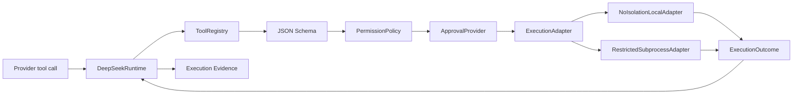

# DeepSeek Runtime 技术架构

> 状态：Current + Target Architecture  
> 适用基线：`develop@a8a0f3c8d0e417fa8ffe465cec1763063ca9eead`；M2-C implementation PR #18  
> 当前阶段：M1、M2-A、M2-B Closed；M2-C In Progress  
> 发布结论：**NO RELEASE**

## 1. 架构目标

DeepSeek Runtime 是 local-first Agent Runtime Kernel。核心目标不是扩展更多 Agent 功能，而是建立一条可验证、不可静默绕过、失败可解释的生产执行链：

```text
Provider
→ Runtime
→ ToolRegistry / JSON Schema
→ PermissionPolicy / ApprovalProvider
→ ExecutionAdapter
→ Handler or bounded subprocess
→ result normalization
→ Runtime evidence
```

M2-C 只建立执行边界，不完成完整 Runtime 状态机、durable checkpoint、预算、Provider cancellation、Workspace P1 或发布构件。

## 2. 当前模块与成熟度

| 模块 | 当前职责 | 当前状态 |
| --- | --- | --- |
| `client.py` | HTTP、SSE、ProviderResult、配置 | Partial；response normalization、retry、真正增量流式仍未完成 |
| `runtime.py` | Provider/tool loop、Registry、Policy、Approval、Adapter 编排 | M2-A/B 已合入；M2-C Adapter 接入在 PR #18 |
| `contracts/*` | Error、State、Tool、Checkpoint、Evidence、Recovery、Journal | M1/M2-A 最小合同已冻结 |
| `approval.py` | Policy/Approval 强制链与内容最小化事件 | Verified for M2-B 内存路径 |
| `execution.py` | Adapter 合同、Fake/NoIsolation/RestrictedSubprocess | M2-C implementation；待最终 Gate/merge |
| `workspace.py` | canonical resolver、link/reparse-point containment | Verified for M1 P0 |
| `security.py` | PermissionPolicy、WorkspaceSandbox compatibility、ChangeManager | 命令路径已迁移到 Adapter；类名不代表内核隔离 |
| `session.py` | Session/ToolCallRecord、恢复原语 | Partial；未统一接入最终 lifecycle |
| `evidence.py` | 请求/响应结构证据与脱敏 | Partial；M3 totality/canonical/privacy 仍未完成 |
| `observability.py` | usage、cost、成功率汇总 | Partial；unknown 与预算语义未收口 |
| `cli.py` | doctor/run | Partial；M2-F 输出和 exit-code 协议未完成 |
| `.github/workflows/*` | Minimum CI、M1 P0 Gate、M2 Adapter Gate | M2-C 新增三平台专项证据 |

## 3. 当前生产调用链

### 3.1 已合入 develop 的边界

M2-A：

- `ToolRegistry` 是 `DeepSeekRuntime` 接受的生产工具集合；
- ToolSpec 完成名称、schema、risk、side-effect、limit 与 recovery 注册合同；
- Provider tool definition 从 ToolSpec 生成；
- malformed call、unknown tool、invalid result 有结构化错误。

M2-B：

- Registry/schema 后、handler 前强制 `PermissionPolicy`；
- `ASK` 必须经过 `ApprovalProvider`；
- deny、timeout、unavailable、provider exception 均 fail-closed；
- authorization event 内容最小化。

### 3.2 PR #18 增加的 M2-C 边界



强制顺序：

1. Provider tool-call shape 校验；
2. Registry lookup；
3. JSON Schema 参数校验；
4. Policy decision；
5. ASK approval；
6. Adapter execution；
7. result normalization；
8. authorization/execution evidence。

Registry/schema/Policy/Approval 失败时 Adapter 调用次数为 0。

## 4. ExecutionAdapter 模型

### 4.1 公共合同

```python
class ExecutionAdapter(Protocol):
    name: str
    capabilities: ExecutionCapabilities

    def execute(
        self,
        spec: ToolSpec,
        arguments: dict[str, Any],
        context: ExecutionContext,
    ) -> ExecutionOutcome: ...
```

`ExecutionCapabilities` 明确：

- isolation level；
- timeout enforcement；
- cancellation enforcement；
- byte output limit；
- process-tree cleanup；
- minimal environment；
- kernel isolation。

当前所有 Adapter 的 `kernel_isolation=false`。

### 4.2 FakeExecutionAdapter

- deterministic scripted outcome；
- 不调用 handler；
- 记录测试调用；
- 用于 ordering、failure、cancellation 和 evidence 测试；
- 不虚标 timeout、output、process-tree 或 minimal-env 能力。

### 4.3 NoIsolationLocalAdapter

- 当前 Python 进程内调用可信 handler；
- 保持现有 read/search 等 Python 工具兼容；
- handler exception 转为结构化 `TOOL_EXECUTION_FAILED`，不发布异常正文；
- 只在开始前识别 cancellation；
- 不提供 timeout、运行中 cancellation、输出限制、环境最小化、进程清理或 OS 隔离。

这是显式低保证 Adapter，不得被描述为 sandbox。

### 4.4 RestrictedSubprocessAdapter

注册 handler 是纯 command builder，返回 `SubprocessRequest`，不得自行执行命令。

执行控制：

- command 必须是参数 tuple；
- `shell=False`；
- cwd 必须经过 `WorkspaceResolver`；
- 子进程环境从小型 host allowlist 构建；
- API key、token、authorization、password、credential、secret 等键被移除；
- `PYTHONPATH`、`PYTHONHOME`、`LD_*`、`DYLD_*`、`NODE_OPTIONS` 等 loader/runtime 注入键被移除；
- 使用 ToolSpec `timeout_seconds`；
- stdout/stderr 合并按 byte 限制，保留内容总量不超过 `max_output_bytes`；
- stdin 在独立线程写入，不能阻塞 timeout/cancellation loop；
- timeout、cancel、output overflow 触发 process-tree cleanup；
- Windows 使用 `taskkill /T /F`，辅助进程也使用最小环境；
- Unix 使用独立 process group 和 TERM/KILL；
- builder/spawn/pipe 异常结构化，不公开异常正文。

该 Adapter 是 process-resource boundary，不是 kernel sandbox；同一宿主用户可访问的文件、网络和系统调用仍可能被子进程访问。

## 5. WorkspaceSandbox 兼容路径

`WorkspaceSandbox.run()` 历史上直接调用 `subprocess.run`，形成第二套执行路径。PR #18 将其改为：

```text
command array validation
→ risk classification
→ cwd containment
→ PermissionPolicy
→ temporary ToolSpec/SubprocessRequest
→ configured ExecutionAdapter
→ CommandResult compatibility envelope
```

默认使用 `RestrictedSubprocessAdapter`。`WorkspaceSandbox` 名称是兼容名称，不构成隔离保证。

## 6. ExecutionOutcome 与 Evidence

私有 `ExecutionOutcome` 包含：

- handler/command result；
- adapter identity/capabilities；
- duration；
- output bytes；
- truncated；
- return code；
- optional private receipt。

公开 execution event 仅包含：

- tool；
- adapter；
- capability map；
- succeeded/failed；
- duration；
- output byte count；
- truncated；
- return code；
- error code/cause class。

禁止进入公开 event：

- tool arguments；
- command/cwd；
- env/stdin；
- stdout/stderr；
- result/private receipt；
- handler/builder exception message。

## 7. Runtime 生命周期目标

M2-C 只提供 cancellation token 的 Adapter handoff。完整生命周期由 M2-D 负责：

```text
CREATED
  → PROVIDER_PENDING
  → PROVIDER_COMPLETED
  → TOOL_REQUESTED
  → APPROVAL_PENDING?
  → TOOL_RUNNING
  → TOOL_SUCCEEDED | TOOL_FAILED | TOOL_SIDE_EFFECT_UNCERTAIN
  → PROVIDER_PENDING
  → COMPLETED | FAILED | CANCELLED | BUDGET_EXCEEDED
```

M2-D 必须补：

- Provider 前 cancellation；
- Provider 请求中 cancellation；
- durable TOOL_RUNNING checkpoint；
- token/cost/context/time budgets；
- tool error continue/terminate policy；
- lifecycle event ordering。

## 8. Checkpoint 与恢复

现有合同区分：

```text
RecoverableCheckpoint
- messages/provider continuation
- tool states/arguments/results
- approvals/receipts/budgets
- private/recoverable

PublishableEvidence
- structure/status/usage/safe metadata
- no recoverable content
```

M2-C 的 `ExecutionOutcome.private_receipt` 尚未接入 durable checkpoint；这属于 M2-D/M3，不能由 Adapter Gate 替代。

## 9. Change 与 rollback

ChangeManager 继续使用：

- canonical resolver；
- PermissionPolicy；
- opaque RollbackHandle；
- durable ChangeJournal；
- workspace binding、expiry、pre/post hash；
- stale/cross-workspace/forged rejection。

M3 仍需 lock、parent fsync、metadata policy、duplicate path 和完整 fault matrix。

## 10. 信任边界

| 边界 | 默认信任 | 必须防御 |
| --- | --- | --- |
| 模型输出 | 不可信 | tool name、JSON、路径、命令、超长输出 |
| 用户 prompt | 敏感但合法 | 日志泄漏、间接命令注入 |
| Tool handler/builder | 半可信 | exception、直接副作用、错误结果、secret 泄漏 |
| ExecutionAdapter | 可替换基础设施 | capability 虚标、timeout/cancel 失效、原生异常 |
| 子进程 | 不可信 | inherited env、cwd escape、无限输出、残留进程 |
| 工作区文件 | 不可信 | traversal、symlink/reparse、二进制、巨型文件 |
| Provider response | 不可信 | arbitrary JSON、协议漂移 |
| Checkpoint store | 本地主机可访问 | 明文、篡改、损坏 |
| Release tree | 不可信 | `.env`、未跟踪 secret、构建污染 |

## 11. 三平台验证

M2-C 使用独立 `M2 ExecutionAdapter Gate`：

- Ubuntu / Python 3.11；
- macOS / Python 3.11；
- Windows / Python 3.11。

Gate 直接覆盖：

- Adapter capability；
- minimal environment；
- loader env stripping；
- cwd containment；
- timeout；
- byte output limit；
- blocking stdin；
- cancellation handoff；
- descendant cleanup；
- Runtime ordering；
- WorkspaceSandbox migration；
- exception/evidence privacy；
- command Gate 非隔离声明。

每个 job 上传明确分母的 JSON evidence。workflow 不自动取消旧运行，并在合入 `develop` 后继续执行。

## 12. Deferred / non-goals

PR #18 不实现：

- Docker/Podman adapter；
- OS/kernel sandbox；
- Runtime 完整状态机；
- token/cost/context/time budgets；
- durable checkpoint timing/store；
- Workspace read/search P1 budgets；
- CLI stdout/report/JSON 协议；
- Provider streaming/retry；
- M3 Evidence redesign；
- hosted/multi-tenant security boundary。

## 13. 架构决策

- ADR-001：Runtime 是 local-first kernel，不做 hosted control plane。
- ADR-002：Checkpoint 与 Evidence 分离。
- ADR-003：Command Gate 不等于 sandbox。
- ADR-004：ToolSpec/ToolRegistry 是 Runtime 工具合同入口。
- ADR-005：Side-effect recovery 不承诺通用 exactly-once。
- M2-C contract：ExecutionAdapter 是授权后唯一执行边界；capability 必须可测试且不虚标。
