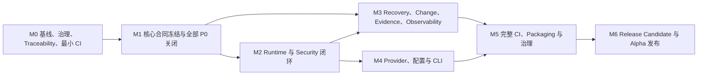

# DeepSeek Runtime 开源就绪执行计划

> 计划版本：2.1
> 计划状态：Approved for execution
> 适用代码审查基线：`develop@0e1e435`
> 文档修订：以本文件所在 Git commit 为准
> 执行分支：`develop`
> 发布分支：`master`
> 唯一目标：以最少新增功能，将现有 DeepSeek Runtime 做到边界真实、执行可控、恢复正确、证据可信、构件可验证，并发布首个可持续维护的 Open-source Alpha。

## 1. 执行结论

本计划不是功能路线图，而是 **Open-source Alpha 发布阻断项清零计划**。

首个 Alpha 不追求成为完整 Agent Framework；它必须先成为一个可被贡献者复现、被安全审查者验证、被集成开发者正确使用的 Runtime Kernel。

执行遵守以下硬约束：

1. `docs/product/PRD.md` 是产品范围、优先级和里程碑的唯一事实源；
2. 所有 P0/P1 Requirement 必须有 Milestone、PR、Test Case 和 Evidence；
3. 任一 P0/P1 Requirement、S0/S1 Defect 或恢复语义不确定项未关闭，禁止发布；
4. 测试、文档和发布证据属于实现，不允许集中拖到最后补；
5. 不用新增展示型功能掩盖 Runtime、安全、恢复和发布工程缺陷；
6. 不把命令分类器、cwd 限制或普通 subprocess 描述为内核级隔离；
7. 不承诺任意外部系统 exactly-once；无法确认的副作用必须进入 `TOOL_SIDE_EFFECT_UNCERTAIN`；
8. 任何测试优先级冲突以 PRD 为准，测试文档不得隐式修改 Requirement；
9. 所有开发默认进入 `develop`，Release Gate 全通过后才合并到 `master` 并打 tag。

## 2. Alpha 产品边界

### 2.1 必须交付

- DeepSeek Provider 请求、响应规范化和错误分类；
- text-only 和多轮 tool-call Runtime；
- 不可绕过的 ToolRegistry、参数校验、Policy、Approval 和 Execution Adapter；
- step、token、cost、context、time、tool timeout 和 output-size 预算；
- workspace containment、symlink/reparse-point 防护和资源预算；
- 安全文件变更、冲突检测、best-effort 多文件语义和受约束回滚；
- checkpoint/evidence 分离和明确恢复状态机；
- 不确定副作用的人工协调流程；
- 默认安全、可分享的 Evidence 和 Diagnostics；
- 可读 CLI 最终回答和独立安全报告；
- Linux、macOS、Windows 与 Python 3.11–3.13 CI；
- wheel/sdist、secret scan、digest 校验、干净环境安装和真实 DeepSeek smoke；
- LICENSE、SECURITY、CONTRIBUTING、治理和发布流程。

### 2.2 明确不做

首个公开 Alpha 前不新增：

- MCP、Skills、Multi-Agent；
- RAG、Vector Memory；
- IDE、TUI、Desktop；
- Hosted API；
- Plugin Marketplace；
- Workflow DSL；
- Browser / Computer Use；
- 多 Provider 横向扩张；
- 云端多租户、账号、计费和组织权限；
- 通用 exactly-once 外部副作用保证；
- 默认交付 Docker/Podman/平台内核级隔离实现。

## 3. 安全配置与承诺边界

### 3.1 `NoIsolationLocalAdapter`

- 仅用于可信本地开发环境；
- 不提供操作系统隔离；
- 危险操作默认 DENY；
- 文档、类型和 CLI 必须明确 `NoIsolation`；
- 禁止描述为 sandbox。

### 3.2 `RestrictedSubprocessAdapter`

首个 Alpha 的最低执行适配器，必须实现：

- 最小环境变量，不继承 `DEEPSEEK_API_KEY` 等敏感变量；
- 明确 cwd；
- timeout；
- process-tree cleanup；
- stdout/stderr 字节上限；
- cancellation；
- 结构化错误；
- Windows、macOS、Linux 差异说明。

该适配器仍不承诺内核级隔离。

### 3.3 未承诺边界

Alpha 防御：

- 不可信模型输出；
- 不可信 Provider response；
- 不可信工具参数；
- 不可信工作区内容；
- 意外崩溃、文件冲突和构件污染。

Alpha 不承诺抵抗：

- 同一主机上的恶意并发进程在检查后替换文件、symlink 或句柄；
- 已获得相同用户权限的恶意程序；
- 内核、容器运行时或宿主机被攻破；
- 外部系统不支持幂等键、receipt 或查询时的 exactly-once。

因此 workspace containment 必须表述为 Runtime 自身不可绕过的路径治理，不得描述为对同主机恶意进程的完整隔离。

## 4. 执行依赖

原计划中“先实现 side-effect uncertain、后冻结状态和 checkpoint 合同”会造成二次返工。修订后采用 contract-first 顺序：



关键顺序：

```text
文档与最小 CI
→ Error/State/Checkpoint/Recovery 合同
→ P0 containment/rollback/uncertain
→ Runtime 执行闭环
→ 完整恢复、变更和证据
→ Provider/CLI
→ Packaging/Release
→ RC
```

禁止使用旧 SessionState 先完成 Runtime 重构，再整体替换 checkpoint schema。

## 5. 里程碑总览

| Milestone | 目标 | 主要 PRD 域 | Exit Gate |
| --- | --- | --- | --- |
| M0 | 建立单一事实源、Threat Model、Traceability 和最小 CI | 全部文档、OSS | P0/P1 全映射；最小 CI 强制执行 |
| M1 | 冻结核心合同并关闭全部 P0 | RUN、TOOL、SES、WS、CHG、EVD | 合同评审通过；6 个原 P0 用例及新增 handle 用例通过 |
| M2 | 建立不可绕过 Runtime/Security 闭环 | RUN、TOOL、SEC、WS、CLI | Runtime/Tool/Security P1 门禁通过 |
| M3 | 完成恢复、变更、证据和指标正确性 | CHG、SES、EVD、OBS | crash/conflict/privacy 用例通过 |
| M4 | 完成 Provider、配置和 CLI 协议收口 | CFG、PROV、CLI、DOC | Provider/配置/CLI 用例全绿 |
| M5 | 完成完整 CI、构件和治理 | OSS、CFG | 多平台、构件、治理和 live smoke 全绿 |
| M6 | 独立 RC 验证并发布 Alpha | 全部 | Requirement Verified；Active P0/P1/S0/S1 = 0 |

# M0：基线、治理、Traceability 与最小 CI

## 6. M0 目标

在修改高风险代码前，先建立范围、威胁模型、追踪矩阵和自动化门禁，避免修复工作在无持续验证的环境中进行。

## 6.1 工作项

### M0-A 单一事实源

- PRD、测试用例、测试计划、路线图使用同一 M0–M6；
- README 只引用 PRD、架构、测试和路线图，不隐式新增需求；
- 每项能力标记 `Implemented / Partial / Planned / Blocked / Verified`；
- P2 Test Case 不得进入 P0/P1 Release Gate；
- `CHG-009` 提升为 P1，明确 best-effort 多文件事务边界；
- 新增 `CHG-010`，明确 durable ChangeJournal 与 handle 生命周期。

### M0-B Traceability

建立并维护：

```text
Requirement
→ Milestone
→ Owner Role
→ Implementation PR
→ Test Case
→ Test Level
→ Automation Status
→ Expected Evidence
→ Last Evidence
→ Status/Blocker
```

追踪矩阵必须可由脚本检查：

- 每个 P0/P1 Requirement 至少一个 P0/P1 Test Case；
- 每个 P0/P1 Test Case 引用存在的 Requirement；
- Test priority 不高于或低于 Requirement，除非在矩阵中有显式批准说明；
- README claim 必须映射到 Requirement + Test + Evidence。

### M0-C Threat Model

至少包含：

- 保护资产；
- 攻击输入；
- 信任边界；
- 首个 Alpha 保证；
- 首个 Alpha 不保证；
- 同主机恶意并发进程不在承诺范围；
- rollback handle、ChangeJournal、checkpoint 和 artifact 的边界；
- 漏洞响应流程。

### M0-D ADR

至少记录：

- ADR-001：ToolRegistry 是唯一工具入口；
- ADR-002：Checkpoint 与 Evidence 分离；
- ADR-003：RecoveryPolicy 和 uncertain/manual 语义；
- ADR-004：RestrictedSubprocess 不等于隔离；
- ADR-005：JSON Schema 实现；
- ADR-006：Pyright 或 Mypy 单一选择；
- ADR-007：版本、schema、error-code 兼容策略；
- ADR-008：`develop → master → tag`；
- ADR-009：Rollback handle + durable ChangeJournal 生命周期；
- ADR-010：Coverage 和 Gate manifest 定义。

### M0-E License 与治理前置

- LICENSE；
- NOTICE / third-party attribution；
- 依赖许可证初步检查；
- CONTRIBUTING 最小版本；
- SECURITY 最小版本；
- support policy；
- breaking-change policy。

### M0-F 最小 CI

每个 PR 至少运行：

```text
Python 3.11
→ lint
→ type-check 基础模式
→ 现有 unit tests
→ 新增 regression tests
→ package import
→ tracked-secret scan
→ docs traceability
```

## 6.2 M0 Exit Gate

必须全部满足：

- 所有 P0/P1 Requirement 有 Milestone、Test ID 和 Expected Evidence；
- 没有无归属 P0/P1；
- PRD/Test/Plan/Milestone 无冲突；
- README 不包含 PRD 外公开承诺；
- Threat Model 和安全配置完成评审；
- License 可合法公开分发；
- 最小 CI 在 develop PR 上自动执行；
- 当前已有 tests 全绿；
- 文档链接和 traceability 检查通过。

## 6.3 禁止事项

- 不在 M0 重构 Runtime；
- 不添加新 Provider；
- 不用 coverage 数字替代 P0 对抗测试；
- 不建立复杂社区治理组织。

# M1：核心合同冻结与全部 P0 关闭

## 7. M1 目标

先冻结 Error、State、Checkpoint、Evidence、Tool、Recovery 和 ChangeJournal 最小合同，再实现 P0 修复，避免 side-effect uncertain 和 rollback 在旧 schema 上返工。

## 7.1 M1-A 最小合同

必须先定义：

### Error Contract

- machine-readable code；
- stable fields；
- cause/redaction 规则；
- versioning 与 compatibility。

### Runtime State Contract

```text
CREATED
→ PROVIDER_PENDING
→ PROVIDER_COMPLETED
→ TOOL_REQUESTED
→ APPROVAL_PENDING?
→ TOOL_RUNNING
→ TOOL_SUCCEEDED | TOOL_FAILED | TOOL_SIDE_EFFECT_UNCERTAIN
→ PROVIDER_PENDING
→ COMPLETED | FAILED | CANCELLED | BUDGET_EXCEEDED
```

每次转换定义：

- 合法前驱；
- lifecycle event；
- checkpoint 时机；
- error code；
- recovery eligibility；
- retry eligibility；
- receipt/approval 要求。

### Checkpoint / Evidence Contract

`RecoverableCheckpoint`：

- Provider continuation；
- messages；
- tool-call states；
- approvals；
- receipts；
- budgets；
- schema version；
- recovery metadata；
- 可选加密。

`PublishableEvidence`：

- request/response 结构；
- 长度、HMAC/安全 identity、usage、cost；
- redacted metadata；
- error code；
- 不含可恢复正文。

### Tool / Recovery Contract

`ToolSpec` 至少包含：

- name、description、parameters、handler；
- risk、side_effect；
- timeout_seconds、max_output_bytes；
- recovery_policy。

`RecoveryPolicy` 至少包含：

- PURE；
- IDEMPOTENT；
- RETRYABLE_WITH_KEY；
- NON_IDEMPOTENT；
- MANUAL_RECONCILIATION。

### Rollback / ChangeJournal Contract

- 调用方只持有 opaque handle；
- handle 引用 Manager 维护的受保护 ChangeJournal；
- Journal 保存 workspace identity、changeset identity、pre/post hash、恢复数据、expiry 和 schema version；
- handle 不能携带调用方可篡改的路径和正文；
- 重启后若 Journal 可用，合法 handle 可恢复；
- missing、expired、forged、cross-workspace handle 结构化拒绝；
- Journal 是否加密、保留多久和清理策略必须明确。

M1-A Gate：相关 ADR、类型、transition table、schema 和合同测试通过后，才能进入 M1-B/C/D。

## 7.2 M1-B Workspace Containment

对应 `WS-001`、`WS-002`：

- read/search 共用 canonical path resolver；
- 每个候选读取前 resolve + containment；
- 默认跳过 symlink 和 Windows reparse point；
- 使用 lstat 区分链接；
- 读取时复核可检测的变化；
- search 加文件数、总字节数和时间预算；
- 外部路径和正文不进入公开 evidence。

必须通过：

- `TC-WS-001`；
- `TC-WS-002`；
- `TC-WS-003`。

## 7.3 M1-C Rollback Authorization

对应 `CHG-001`、`CHG-002`、`CHG-010`：

- 删除调用方可构造的公开 rollback payload；
- 使用 manager-issued opaque handle；
- handle lookup 必须验证 Journal、workspace、changeset、expiry 和 schema；
- rollback 重新执行 containment 和 policy；
- rollback 前校验 post-change hash；
- forged、expired、cross-workspace、stale handle 结构化失败；
- 默认 audit 不包含文件正文。

必须通过：

- `TC-CHG-001`；
- `TC-CHG-002`；
- `TC-CHG-011`。

## 7.4 M1-D Side-effect Uncertain

对应 `SES-007`：

- side-effect tool 从 `TOOL_RUNNING` 恢复时不得自动重试；
- 进入 `TOOL_SIDE_EFFECT_UNCERTAIN`；
- Runtime 安全停止并返回结构化结果；
- 用户显式选择 reconcile、mark-succeeded、mark-not-executed、abandon 或 explicit-retry；
- succeeded 状态继续保持不重复执行；
- 人工决策写入 checkpoint 和 evidence。

必须通过 `TC-SES-007`。

## 7.5 M1 Exit Gate

- M1-A 合同评审通过；
- `TC-WS-001`–`003`、`TC-CHG-001`、`002`、`011`、`TC-SES-007` 通过；
- P0 测试在适用平台连续运行 20 次无失败；
- Active P0 = 0；
- Active S0 = 0；
- SECURITY、Known Unknowns、Code Review、Traceability 同步更新；
- 不通过 rerun 掩盖失败。

# M2：Runtime 与 Security 闭环

## 8. M2 目标

将 Tool、Policy、Approval、Execution Adapter、Budget、Cancellation 和 Lifecycle 接入唯一 Runtime 生产路径。

## 8.1 ToolRegistry 唯一入口

- Runtime 不接收裸 `dict[str, handler]`；
- 内建工具也注册为 ToolSpec；
- 未知工具在 handler 前失败；
- 参数按 JSON Schema 校验；
- 非字符串结果规范化或结构化拒绝；
- handler 异常统一为 ToolExecutionResult；
- duplicate name 和缺失 risk/recovery/limits 注册失败。

## 8.2 Policy 与 Approval

- 每次工具执行产生 policy decision；
- 非 READ 默认 DENY；
- 规则优先级确定且有 overlap tests；
- ASK 必须调用 ApprovalProvider；
- approve once / approve session / deny / timeout；
- approval 只展示安全摘要；
- decision 和 approval 进入 checkpoint/evidence。

## 8.3 Execution Adapter

实现并接入：

- FakeExecutionAdapter；
- NoIsolationLocalAdapter；
- RestrictedSubprocessAdapter；
- minimal env、timeout、process-tree cleanup、cancellation、output limit、cwd、structured failure。

## 8.4 Runtime Lifecycle 与 Budget

- 每个状态转换发送 lifecycle event；
- 关键状态 checkpoint；
- provider/tool/error/cancel/budget 路径返回 RuntimeResult；
- malformed Provider 不产生未处理异常；
- max steps/token/cost/context/time 达阈值停止；
- tool error 继续或终止策略可配置；
- hook 为 P2，不阻塞 Alpha。

## 8.5 Workspace P1 完整性

- read byte limit 和 UTF-8 截断；
- search file/byte/time budget；
- binary、permission、file-disappeared 结构化错误。

## 8.6 CLI 核心

- run 默认 stdout 输出最终回答；
- stderr 输出进度和警告；
- `--report` 独立输出安全 Evidence；
- `--json` 输出稳定机器结果；
- 明文 debug 使用明显危险开关；
- exit code 与 error code 对应。

## 8.7 M2 Exit Gate

必须通过：

- `TC-RUN-001`–`013`，不含 P2 `TC-RUN-014`；
- `TC-TOOL-001`–`007`，不含 P2 `TC-TOOL-008`；
- `TC-WS-004`–`006`；
- `TC-SEC-001`–`009`；
- `TC-CLI-001`–`006`。

附加要求：

- 不存在裸 handler 生产路径；
- 每次工具执行都有 policy event；
- side-effect tool 必须有 recovery policy；
- transition manifest 合法和非法类别 100% 覆盖；
- Runtime 状态实现 branch coverage ≥95%；
- Active P1 Runtime/Tool/Security defect = 0。

# M3：Recovery、Change、Evidence 与 Observability

## 9. M3 目标

完成 crash、并发、冲突、隐私和不完整指标条件下的正确性。

## 9.1 Checkpoint Store

- 原子写入；
- 父目录持久化语义；
- file lock；
- corruption detection；
- schema migration；
- unsupported future version；
- 可选 encryption key injection；
- 读取失败不覆盖原文件；
- approvals、budgets、receipts roundtrip。

## 9.2 Side-effect Recovery

对三个窗口 fault injection：

1. effect 前崩溃；
2. effect 成功后、checkpoint 保存前崩溃；
3. succeeded 保存后崩溃。

必须实现：

- succeeded 不重复；
- uncertain 不自动重试；
- retry budget；
- idempotency key；
- receipt 验证接口；
- manual reconciliation API；
- mark-succeeded / mark-not-executed / abandon / explicit-retry；
- 人工决策进入 checkpoint/evidence。

## 9.3 ChangeManager P1 Hardening

- duplicate path rejection；
- workspace/file lock；
- validate/write 冲突检测；
- stage files；
- mode/metadata 策略；
- file/directory fsync；
- failure compensation；
- stale rollback conflict；
- ChangeJournal lifecycle；
- audit 不含正文；
- 明确 best-effort 多文件事务，不声称跨目录严格原子性。

## 9.4 Evidence

- 任意 JSON-compatible 输入 total function；
- canonical JSON；
- request identity 包含 provider/method/endpoint/body；
- exception secret redaction；
- 低熵敏感文本不输出可猜裸 SHA-256；
- schema version；
- PUBLIC / LOCAL_SAFE / LOCAL_DEBUG / CHECKPOINT_SECRET 分级；
- debug content 默认关闭。

## 9.5 Observability

- provider/tool/step latency；
- token/cache/cost；
- unknown 保持 unknown；
- 输入 token 无拆分时正确计费；
- 负数、NaN、非法价格拒绝；
- partial metric 分母只使用已知值；
- budget stop 产生 evidence。

## 9.6 M3 Exit Gate

必须通过：

- `TC-CHG-003`–`011`；
- `TC-SES-001`–`011`；
- `TC-EVD-001`–`007`；
- `TC-OBS-001`–`007`。

附加要求：

- Recovery manifest 中全部 P0/P1 组合有确定预期；
- recovery 实现 branch coverage ≥95%；
- checkpoint 加密开启时磁盘无 prompt/tool content 明文；
- 未开启加密时文档明确本地主机可读风险；
- 无 silent retry、silent overwrite、silent metric coercion。

# M4：Provider、配置与 CLI 协议收口

## 10. M4 目标

完成外部协议、配置、版本和用户入口的稳定合同。

## 10.1 配置与版本

- Python 3.11–3.13；
- 包版本单一真源；
- diagnostics/artifact/package/tag 一致；
- env 类型和范围校验；
- `env={}` 不读取宿主环境；
- repr/log/doctor/error 不泄露 Key。

## 10.2 Provider 非流式

- arbitrary JSON root normalization；
- choices/message/tool_calls shape validation；
- auth/rate-limit/timeout/transport/5xx mapping；
- retry/backoff + fake clock；
- retry budget；
- response-size limit；
- request identity 和 request id；
- evidence totality。

## 10.3 Provider 流式

- 任意 byte chunk boundary；
- incremental UTF-8 decoder；
- SSE framing；
- multiline data；
- event/id/comment；
- `[DONE]`；
- malformed event evidence；
- iterator/callback；
- cancellation；
- final aggregation；
- usage reconciliation；
- 不缓存完整响应后伪装 streaming。

## 10.4 CLI 与 Doctor

- 默认回答、report、json、unsafe debug 和 exit code 语义稳定；
- doctor 明确区分“本地诊断成功”和“具备在线运行条件”。

## 10.5 M4 Exit Gate

- `TC-CFG-001`–`006`；
- `TC-PROV-001`–`015`；
- `TC-CLI-001`–`006`；
- `TC-DOC-001`；
- Provider 必需 fixture normalization = 100%；
- 无 active P1 CFG/PROV/CLI/DOC defect。

# M5：完整 CI、Packaging 与治理

## 11. M5 目标

使任何贡献者都可以在干净环境复现测试、构件和发布证据。

## 11.1 完整 CI

矩阵：

- Ubuntu / macOS / Windows；
- Python 3.11 / 3.12 / 3.13；
- Ruff；
- Mypy 或 Pyright 单一选择；
- unit/component/integration；
- property/fuzz；
- security adversarial；
- recovery fault injection；
- coverage；
- package build/install；
- docs traceability。

## 11.2 指标 Gate

- line coverage ≥85%；
- branch coverage ≥75%；
- P0 manifest 目标分支 coverage = 100%；
- Runtime transition 合法/非法类别 coverage = 100%；
- Runtime 状态模块 branch coverage ≥95%；
- Recovery manifest P0/P1 组合期望覆盖 = 100%；
- Provider 必需 error fixture 通过率 = 100%；
- Release Gate 通过率 = 100%；
- gate evaluator branch coverage ≥90%。

分母定义以 `docs/testing/test-plan.md` 为准，不允许使用未定义的“≥90% normalization”或“≥90% release gate”替代真实 Gate。

## 11.3 Release Artifact

- 从 Git tracked allowlist 构建；
- wheel + sdist；
- `.env`、checkpoint、ChangeJournal、未跟踪文件不进入构件；
- secret scan；
- 实际重算 SHA-256；
- 修改构件一个 byte 时 gate 失败；
- reproducible metadata；
- release manifest；
- dependency list / SBOM 可为 P2，但依赖清单必须存在；
- clean venv install；
- CLI/import smoke。

## 11.4 Governance

- CONTRIBUTING；
- CODE_OF_CONDUCT；
- SECURITY；
- issue templates；
- PR template；
- changelog；
- release process；
- support policy；
- dependency/security update policy。

## 11.5 M5 Exit Gate

- `TC-OSS-001`–`010`；
- `TC-LIVE-001`；
- 多平台矩阵全绿；
- 无已知 flaky test；
- artifact secret scan/digest/tamper 全绿；
- README claim traceability = 100%；
- wheel/sdist clean install；
- live smoke 通过。

# M6：Release Candidate 与 Alpha 发布

## 12. M6 目标

冻结代码和公开承诺，执行独立 RC 验证并作出明确 Release / No Release 决策。

## 12.1 RC 冻结

进入 RC 后只允许：

- P0/P1 defect fix；
- 测试稳定性修复；
- 文档事实修正；
- release pipeline fix。

禁止新增功能、公共 API 或新依赖，除非用于解决发布阻断并经过 ADR。

## 12.2 RC 检查

- README Quick Start 干净机器逐行执行；
- API examples 逐行执行；
- Python 3.11–3.13 clean install；
- Fake Provider E2E；
- live DeepSeek 固定 smoke；
- usage/cost/evidence 验证；
- checkpoint/recovery E2E；
- tool approval E2E；
- workspace symlink adversarial；
- rollback restart/expired/cross-workspace；
- artifact tamper test；
- License/NOTICE；
- 依赖和供应链审查；
- version/tag/artifact 一致；
- known limitations；
- final test report；
- release notes；
- upgrade/breaking-change note。

## 12.3 最终 Release Gate

### Requirement Gate

- 所有 P0/P1 Requirement = `Verified`；
- 所有 Requirement 有自动化证据或批准的 RC 人工证据。

### Defect Gate

- Active P0/P1/S0/S1 = 0；
- 无未解释的数据泄漏、越界访问、权限绕过或重复副作用风险。

### Test Gate

- P0/P1 Test Case 100% 通过；
- 多平台 CI 全绿；
- 无已知 flaky test；
- P0 安全测试连续运行无失败；
- live smoke 通过；
- test report 明确给出 `Release`。

### Artifact Gate

- wheel/sdist clean install；
- secret scan；
- digest 重算匹配；
- tampered artifact 被拒绝；
- version、tag、artifact、manifest 一致；
- README claim traceability = 100%。

任一 Gate 不满足，结论必须是 `No Release`。

## 13. Requirement 归属

| PRD 域 | P0/P1 范围 | Milestone |
| --- | --- | --- |
| CFG | CFG-001–005 | M4、M5 |
| PROV | PROV-001–009 | M1、M4 |
| RUN | RUN-001–010 | M1、M2 |
| TOOL | TOOL-001–007 | M1、M2 |
| WS | WS-001–005 | M1、M2 |
| SEC | SEC-001–009 | M0、M2 |
| CHG | CHG-001–010 | M1、M3 |
| SES | SES-001–010 | M1、M3 |
| EVD | EVD-001–008 | M1、M3 |
| OBS | OBS-001–007 | M1、M3 |
| CLI/DOC | CLI-001–006、DOC-001 | M2、M4 |
| OSS | OSS-001–011 | M0、M5、M6 |

P2 不阻塞 Alpha，除非被批准为某项 P0/P1 的技术前置。

## 14. 建议 PR 序列

每个 PR 必须独立可测试、可 review；禁止超大合并。

| PR | 范围 | 依赖 | 规模 |
| --- | --- | --- | --- |
| PR-00 | 文档一致性、Threat Model、Traceability、最小 CI | 无 | M |
| PR-01 | Error/State/Checkpoint/Evidence/Recovery 合同 | PR-00 | L |
| PR-02 | ToolSpec、Registry、JSON Schema 合同 | PR-01 | L |
| PR-03 | ChangeJournal 与 opaque rollback handle 合同 | PR-01 | M |
| PR-04 | Workspace containment 与 symlink/reparse point | PR-00、01 | M |
| PR-05 | Rollback authorization、restart 和 conflict | PR-03、04 | L |
| PR-06 | Side-effect uncertain 最小安全语义 | PR-01、02 | M |
| PR-07 | Policy、Approval、audit | PR-02 | M |
| PR-08 | ExecutionAdapter、timeout、process tree、env | PR-02、07 | L |
| PR-09 | Runtime lifecycle、budget、cancellation | PR-01、02、07、08 | L |
| PR-10 | CLI result/report/exit-code/doctor semantics | PR-09 | M |
| PR-11 | Checkpoint store、migration、encryption | PR-01、09 | L |
| PR-12 | Receipt、reconciliation、fault injection | PR-06、11 | L |
| PR-13 | ChangeManager lock/conflict/fsync/metadata | PR-05、11 | L |
| PR-14 | Evidence canonical/redaction 与 Observability | PR-01、09 | M |
| PR-15 | Provider normalization/retry/size | PR-01 | L |
| PR-16 | Incremental SSE streaming | PR-15 | L |
| PR-17 | Config/version/CLI protocol stabilization | PR-10、15 | M |
| PR-18 | Full CI、packaging、artifact verification | 前述核心 PR | L |
| PR-19 | Governance、README traceability、RC report | PR-18 | M |

规模：

- S：单一模块局部修改；
- M：跨 1–2 个模块，接口明确；
- L：跨模块状态或协议变更，必须先有 ADR/contract review。

同一时间最多两个 L 级 PR，并且不得同时修改相同核心 schema。

## 15. 每个 PR 的 Definition of Done

任何工作项只有同时满足以下条件才能合入 develop：

- 实现与 PRD Requirement 一致；
- 对应 Test Case 已自动化；
- 至少包含 happy、failure、adversarial/fault path；
- lint、type-check、相关 tests 全绿；
- 不通过 rerun 隐藏失败；
- 公共 API 有 type hints；
- error code/schema/versioning 同步；
- README/PRD/architecture/Threat Model/Known Unknowns 按需同步；
- Traceability 更新 Requirement、PR、Test、Evidence 和 Status；
- 默认日志无 secret、prompt、response、reasoning 和工具正文；
- reviewer 检查 threat model、rollback、recovery 和兼容性；
- PR 描述包含问题、根因、设计、风险、测试证据和回滚方式。

“代码写完、测试以后补”不符合 Definition of Done。

## 16. 分支与发布策略

### 开发

- 日常工作基于 develop；
- feature/fix 分支从最新 develop 创建；
- 通过 PR 合并到 develop；
- 禁止在 master 直接开发。

### Release Candidate

- M5 完成后从 develop 创建 RC；
- RC 修复先进入 develop；
- RC Gate 全通过后 develop 合并到 master；
- tag 只从 master 产生；
- artifact 只由 tag workflow 产生。

### Hotfix

- 从 master 创建；
- 修复后合入 master；
- 同一修复必须回流 develop；
- 禁止 master/develop 长期漂移。

## 17. 风险登记

| 风险 | 触发信号 | 应对 |
| --- | --- | --- |
| 为“生产级”引入过多抽象 | 新增大量未被 P0/P1 使用的接口 | 只实现最小合同 |
| Runtime/checkpoint 二次返工 | 先改 loop，后定义 state/schema | M1 contract-first |
| Sandbox 过度承诺 | 文档出现 secure sandbox/isolated | 强制 NoIsolation/Restricted 命名 |
| exactly-once 错误承诺 | 仅凭 idempotency key 宣称不重复 | RecoveryPolicy + receipt + uncertain/manual |
| Rollback handle 不可恢复或可伪造 | handle 携带路径/正文或仅绑定内存实例 | durable ChangeJournal + opaque handle |
| Workspace 过度承诺 | 声称抵抗同主机恶意进程 | Threat Model 明确排除边界 |
| 跨平台文件语义不一致 | Windows junction/fsync/process tree 失败 | 平台专用测试和已知限制 |
| Provider 协议漂移 | live smoke/fixture 失败 | adapter normalization + fixtures manifest |
| 测试优先级漂移 | P2 case 阻断 P1 release | PRD 唯一事实源 + traceability gate |
| 假精确 Coverage | 指标无 manifest/分母 | 固定分母和 gate manifest |
| Release 构件污染 | 工作树文件进入包 | Git tracked allowlist + clean build |
| CI 过慢 | PR 反馈失控 | PR 最小矩阵 + nightly/full release |
| 大 PR 无法审查 | 单 PR 同时改状态、存储、CLI | 按 PR-00–19 拆分 |

## 18. No-Go 条件

出现任一情况必须暂停推进：

- 新发现可越界读写、密钥泄漏、发布 secret 或重复高价值副作用；
- P0 测试失败或被 quarantine；
- Runtime 存在绕过 Registry/Policy/Adapter 的生产路径；
- checkpoint 无法区分 failed、running、uncertain；
- rollback handle 可伪造、跨 workspace 或重启语义不明；
- artifact 不能证明来源或 digest；
- License/第三方代码来源不明确；
- CI 只能通过 rerun；
- README 宣称超过 Verified 能力；
- 为完成里程碑降低断言或删除安全用例；
- PRD、测试和路线图发生优先级或里程碑冲突。

暂停后必须先更新 PRD、Code Review、Traceability 和 Test Report，再决定修复或调整范围。

## 19. 首个 Alpha 最终形态

> 一个小而可信的 DeepSeek Agent Runtime Kernel：能够执行多步任务，所有工具调用不可绕过治理；任务中断后可恢复，对不确定副作用不会盲目重试；文件变更和回滚边界明确；默认输出不泄露敏感正文；任何贡献者都可在干净环境验证代码、测试和发布构件。

它不需要成为功能最全的 Agent 产品。它必须成为产品边界清楚、执行合同严谨、恢复语义诚实、测试证据完整、最容易安全 fork 的基础内核。