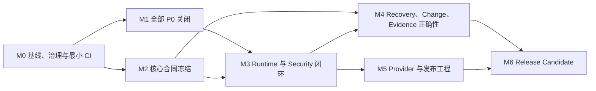

# DeepSeek Runtime 开源就绪执行计划

> 计划版本：2.0
> 计划状态：Approved for execution
> 代码审查基线：`develop@0e1e435`
> 文档修订：以本文件所在 Git commit 为准
> 执行分支：`develop`
> 发布分支：`master`
> 唯一目标：以最少新增功能，把现有 DeepSeek Runtime 做到边界真实、执行可控、恢复正确、证据可信、构件可验证，并发布首个可持续维护的 Open-source Alpha。

---

## 1. 执行结论

本计划不是功能路线图，而是 **Open-source Alpha 发布阻断项清零计划**。

首个 Alpha 不追求成为完整 Agent Framework；它必须先成为一个可以被贡献者复现、被安全审查者验证、被集成开发者正确使用的 Runtime Kernel。

执行中遵守以下硬约束：

1. `docs/product/PRD.md` 是产品范围和优先级的唯一事实源；
2. 所有 P0/P1 Requirement 必须有 Milestone、PR、Test Case 和执行证据；
3. 任一 P0、安全 S0/S1 或恢复语义不确定项未关闭，禁止发布；
4. 测试、文档和发布证据属于实现的一部分，不允许集中拖到最后补；
5. 不以增加展示型功能掩盖 Runtime、安全、恢复和发布工程缺陷；
6. 不把命令分类器、cwd 限制或普通 subprocess 描述为内核级隔离；
7. 不承诺任意外部系统的 exactly-once；对无法确认的副作用必须进入 `TOOL_SIDE_EFFECT_UNCERTAIN`；
8. 所有开发默认进入 `develop`，只有 Release Gate 全通过后才合并到 `master` 并打 tag。

---

## 2. Alpha 产品边界

### 2.1 首个 Alpha 必须交付

- 可验证的 DeepSeek Provider 请求、响应规范化与错误分类；
- 可运行的 text-only 和多轮 tool-call Runtime；
- 不可绕过的 ToolRegistry、参数校验、Policy、Approval 和执行适配器；
- step、token、cost、time、tool timeout 和 output size 预算；
- workspace containment、symlink 防护和资源预算；
- 安全的文件变更、冲突检测和受约束回滚；
- checkpoint、evidence 分离及明确的恢复状态机；
- 不确定副作用的人工协调流程；
- 默认安全、可分享的 Evidence 与 Diagnostics；
- 可读的 CLI 最终回答和独立安全报告；
- Linux、macOS、Windows 与 Python 3.11–3.13 CI；
- wheel/sdist、secret scan、digest 校验、干净环境安装和真实 DeepSeek smoke；
- LICENSE、SECURITY、CONTRIBUTING、治理和发布流程。

### 2.2 首个 Alpha 明确不做

首次公开 Alpha 前不新增：

- MCP；
- Skills；
- Multi-Agent；
- RAG / Vector Memory；
- IDE / TUI / Desktop；
- Hosted API；
- Plugin Marketplace；
- Workflow DSL；
- Browser / Computer Use；
- 多 Provider 横向扩张；
- 云端多租户、账号、计费和组织权限；
- 通用 exactly-once 副作用保证；
- 默认交付 Docker/Podman 隔离实现。

这些能力扩大攻击面和测试矩阵，但不能解决当前发布阻断问题。

---

## 3. Alpha 安全配置

首个 Alpha 只承诺以下执行配置：

### 3.1 `NoIsolationLocalAdapter`

- 用于可信本地开发环境；
- 不提供操作系统隔离；
- 危险命令默认 DENY；
- 文档和类型名称必须明确 `NoIsolation`；
- 禁止将其描述为 sandbox。

### 3.2 `RestrictedSubprocessAdapter`

首个 Alpha 的最低执行适配器，必须实现：

- 最小环境变量，不继承 `DEEPSEEK_API_KEY` 等敏感变量；
- 明确 `cwd`；
- timeout；
- process-tree cleanup；
- stdout/stderr 字节上限；
- cancellation；
- 结构化错误；
- Windows、macOS、Linux 差异说明。

该适配器仍不承诺内核级隔离。

### 3.3 Container / Platform Sandbox

只保留 `SandboxAdapter` 接口和示例边界说明。Docker、Podman、Seatbelt、Job Object 等增强隔离实现不阻塞首个 Alpha。

---

## 4. 计划结构与依赖



关键顺序：

```text
状态模型与数据合同
→ Runtime 执行闭环
→ 完整恢复与持久化
→ Provider/发布工程收口
→ Release Candidate
```

禁止先用旧 SessionState 完成 Runtime 重构、再在后续整体替换 checkpoint schema；这会造成生命周期、恢复入口和序列化结构二次返工。

---

## 5. 里程碑总览

| Milestone | 目标 | 主要 PRD 域 | Exit Gate |
| --- | --- | --- | --- |
| M0 | 建立单一基线、治理和最小 CI | CFG、OSS、DOC | 所有 P0/P1 有归属；最小 CI 强制执行 |
| M1 | 关闭全部 P0 | WS、CHG、SES | 6 个 P0 对抗用例全部通过；无 S0 |
| M2 | 冻结核心执行与恢复合同 | PROV、RUN、TOOL、SES、EVD、OBS | API/schema 状态合同评审通过 |
| M3 | 建立不可绕过的 Runtime/Security 闭环 | RUN、TOOL、SEC、WS、CLI | Runtime/Tool/Security P1 门禁通过 |
| M4 | 完成恢复、变更、证据和指标正确性 | CHG、SES、EVD、OBS | crash/conflict/privacy 用例通过 |
| M5 | 完成 Provider、配置、CLI 和发布工程 | CFG、PROV、CLI、OSS | 多平台 CI、构件与 live smoke 全绿 |
| M6 | 完成 RC 审查与正式 Alpha 发布 | 全部 | Requirement Verified；Active P0/P1 Defect = 0 |

---

# M0：基线、治理与最小 CI

## 6. M0 目标

在修改高风险代码前，先建立范围、威胁模型、分支策略和最小自动化门禁，避免安全与恢复修复在无持续验证的环境中开发。

## 6.1 工作项

### M0-A 文档与 Traceability

- README 只引用 PRD、架构、测试和路线图，不隐式新增需求；
- 为每个现有能力标记 `Implemented / Partial / Planned / Blocked / Verified`；
- 建立 `Requirement → Milestone → PR → Test → Evidence` 矩阵；
- 代码审查基线和文档修订 commit 分开记录；
- 冻结 Alpha 非目标；
- 修正测试用例优先级与 PRD 优先级冲突，以 PRD 为准。

### M0-B Threat Model

新增或完善安全文档，至少包含：

- 保护资产：API Key、prompt、response、reasoning、workspace、外部副作用、release artifact；
- 攻击输入：模型输出、用户输入、Provider response、工具参数、工作区文件、checkpoint、构建工作树；
- 信任边界；
- 首个 Alpha 明确保证；
- 首个 Alpha明确不保证；
- 发现漏洞后的响应流程。

### M0-C Architecture Decision Records

至少记录以下决策：

- ADR-001：ToolRegistry 是唯一工具入口；
- ADR-002：checkpoint 与 evidence 分离；
- ADR-003：副作用恢复语义为 idempotent / retryable-with-key / uncertain / manual；
- ADR-004：RestrictedSubprocess 不等于隔离；
- ADR-005：JSON Schema 实现选择；
- ADR-006：Pyright 或 Mypy 选择；
- ADR-007：版本、schema 和 error-code 兼容策略；
- ADR-008：`develop → master → tag` 发布流程。

### M0-D License 与治理前置

在接受外部贡献前完成：

- LICENSE；
- NOTICE / third-party attribution；
- 依赖许可证初步检查；
- CONTRIBUTING 最小版本；
- SECURITY 最小版本；
- support policy；
- breaking-change policy。

### M0-E 最小 CI

从 M0 开始，每个 PR 至少强制运行：

```text
Python 3.11
→ lint
→ type-check 基础模式
→ 现有 unit tests
→ 新增回归测试
→ package import
→ tracked-secret scan
```

M0 不等待完整三平台矩阵，但不得继续依赖人工执行基础测试。

## 6.2 M0 Exit Gate

必须全部满足：

- 所有 P0/P1 Requirement 均有 Milestone、Test ID 和预期 Evidence；
- 没有无归属的 P0/P1；
- README 不包含 PRD 外的公开能力承诺；
- Threat Model 和首个 Alpha 安全配置完成评审；
- License 可以合法公开分发；
- 最小 CI 在 `develop` 的新 PR 上自动执行；
- 当前已有 tests 全绿；
- 文档链接检查通过。

## 6.3 M0 禁止事项

- 不在 M0 顺便重构 Runtime；
- 不添加新 Provider；
- 不先追求 coverage 数字而忽略 P0 用例；
- 不建立复杂社区治理流程。

---

# M1：关闭全部 P0

## 7. M1 目标

M1 完成后，PRD 中所有 P0 Requirement 必须关闭。M1 不只处理文件系统越界，还必须处理副作用恢复的 S0 风险。

## 7.1 P0-A Workspace Containment

对应：`WS-001`、`WS-002`。

工作项：

- read/search 使用同一 canonical path resolver；
- 每个候选路径在读取前执行 resolve + containment；
- 默认跳过 symlink 和 Windows reparse point；
- 使用 `lstat()` 区分链接；
- 对 race condition 使用读取时复核；
- search 增加文件数、总字节数和时间预算；
- 外部链接不可出现在结果、错误和 evidence 正文中。

必须通过：

- `TC-WS-001`
- `TC-WS-002`
- `TC-WS-003`

## 7.2 P0-B Rollback Authorization

对应：`CHG-001`、`CHG-002`。

工作项：

- 删除调用方可构造的公开 rollback payload；
- 使用 manager-issued opaque handle；
- 原始内容和路径保存在 Manager 私有状态；
- rollback 重新执行 sandbox containment 和 policy；
- handle 绑定 manager instance / workspace / changeset；
- 拒绝 forged、expired、cross-workspace handle；
- rollback 前校验 post-change hash，避免覆盖后续外部修改；
- 回滚失败返回结构化 `ROLLBACK_CONFLICT`。

必须通过：

- `TC-CHG-001`
- `TC-CHG-002`

`TC-CHG-005` 在 M4 完成完整 stale rollback 语义，但 M1 必须先阻止直接伪造和越界。

## 7.3 P0-C Side-effect Uncertain

对应：`SES-007`。

M1 只实现最小安全语义，不等待完整 checkpoint 重构：

- side-effect tool 在 `running` 状态恢复时不得自动重试；
- 进入 `TOOL_SIDE_EFFECT_UNCERTAIN`；
- Runtime 停止并向调用方返回结构化结果；
- 用户必须显式选择 reconcile、mark-succeeded、mark-not-executed 或 abandon；
- 没有 reconciliation API 时，至少安全停止，禁止隐式 retry；
- existing succeeded 状态继续保持不重复执行。

必须通过：

- `TC-SES-007`

## 7.4 M1 Exit Gate

必须全部满足：

```text
TC-WS-001
TC-WS-002
TC-WS-003
TC-CHG-001
TC-CHG-002
TC-SES-007
```

附加要求：

- 6 个用例在 Linux/macOS 运行；适用的 Windows 用例在 Windows 运行；
- 安全用例连续运行 20 次无失败；
- 无已知 S0；
- 无 active P0 Requirement；
- SECURITY、Known Unknowns、Code Review 状态同步更新；
- 不通过 rerun 掩盖失败。

---

# M2：核心合同冻结

## 8. M2 目标

在大规模重构 Runtime 前，冻结执行状态、错误、持久化和恢复合同。M2 允许实现为最小骨架，但接口和语义必须稳定到足以支撑 M3/M4。

## 8.1 Provider Contract

定义：

- `ProviderRequest`；
- `ProviderResponse`；
- `ProviderEvent`；
- `ProviderError`；
- normalized choices/message/tool_calls；
- request identity envelope；
- response body size contract；
- retry eligibility。

任意 JSON-compatible 根必须被 normalize 或返回结构化错误，不能向 Runtime 泄漏任意字典结构。

## 8.2 Tool Contract

最小正式类型：

```python
@dataclass(frozen=True)
class ToolSpec:
    name: str
    description: str
    parameters: dict[str, object]
    handler: ToolHandler
    risk: Risk
    side_effect: bool
    timeout_seconds: float
    max_output_bytes: int
    recovery_policy: RecoveryPolicy
```

`RecoveryPolicy` 至少包含：

- `PURE`
- `IDEMPOTENT`
- `RETRYABLE_WITH_KEY`
- `NON_IDEMPOTENT`
- `MANUAL_RECONCILIATION`

定义：

- `ToolRegistry`；
- `ToolExecutionRequest`；
- `ToolExecutionResult`；
- `ToolReceipt`；
- tool error code；
- 参数和结果规范化规则。

## 8.3 Runtime State Contract

冻结状态机：

```text
CREATED
→ PROVIDER_PENDING
→ PROVIDER_COMPLETED
→ TOOL_REQUESTED
→ APPROVAL_PENDING?
→ TOOL_RUNNING
→ TOOL_SUCCEEDED | TOOL_FAILED | TOOL_SIDE_EFFECT_UNCERTAIN
→ PROVIDER_PENDING
→ COMPLETED | FAILED | CANCELLED | BUDGET_EXCEEDED
```

每次状态转换必须定义：

- 合法前驱；
- lifecycle event；
- checkpoint 时机；
- error code；
- 是否可恢复；
- 是否允许 retry；
- 是否要求 receipt / approval。

## 8.4 Checkpoint 与 Evidence Contract

在 M2 就冻结两个独立模型：

### `RecoverableCheckpoint`

- 完整 Provider continuation；
- messages；
- tool-call state；
- approvals；
- receipts；
- budgets；
- schema version；
- recovery metadata；
- 可选加密。

### `PublishableEvidence`

- request/response 结构；
- 长度、hash/HMAC、usage、cost；
- redacted metadata；
- error code；
- 不含可恢复正文。

## 8.5 Budget 与 Cancellation Contract

统一定义：

- max steps；
- token budget；
- cost budget；
- context budget；
- wall-clock deadline；
- provider timeout；
- tool timeout；
- output bytes；
- cancellation token 和清理责任。

## 8.6 Error Contract

冻结 machine-readable error code、字段和兼容策略。上层不得依赖英文异常字符串。

## 8.7 M2 Exit Gate

必须全部满足：

- 公共类型均有 type hints 和最小示例；
- 所有 enum、schema、error code 有 versioning 规则；
- `ToolSpec` 缺失 risk/recovery/limit 时注册失败；
- duplicate tool name 被拒绝；
- checkpoint/evidence 类型完全独立；
- Runtime state transition table 完整；
- Architecture Review 通过；
- ADR 与技术架构同步；
- 以下合同测试通过：
  - `TC-TOOL-001`
  - `TC-TOOL-002`
  - `TC-TOOL-004`
  - `TC-SES-001`
  - `TC-EVD-003`

---

# M3：Runtime 与 Security 闭环

## 9. M3 目标

将现有安全、工具、预算和生命周期原语接入唯一 Runtime 执行路径，消除裸 handler 和旁路执行。

## 9.1 ToolRegistry 唯一入口

- Runtime 不再接收裸 `dict[str, handler]`；
- 所有内建工具也注册为 ToolSpec；
- Provider tools definition 从 ToolSpec 生成；
- 未知工具在 handler 前失败；
- 参数按 JSON Schema 校验；
- 非字符串工具结果被规范化或结构化拒绝；
- handler 异常统一为 ToolExecutionResult。

## 9.2 Policy 与 Approval

- 所有工具执行必须产生 policy decision；
- 非 READ 默认 DENY；
- 规则优先级确定且有 overlap tests；
- ASK 必须调用 ApprovalProvider；
- approve once / approve session / deny / timeout；
- approval 内容只展示安全摘要，不直接泄露 secret；
- approval 和 decision 进入 checkpoint/evidence。

## 9.3 Execution Adapter

实现并接入：

- `NoIsolationLocalAdapter`；
- `RestrictedSubprocessAdapter`；
- 最小环境；
- timeout；
- process-tree cleanup；
- cancellation；
- output limit；
- cwd；
- structured failure。

## 9.4 Runtime Lifecycle

- Runtime 每个状态转换发送 lifecycle event；
- 每个关键状态可 checkpoint；
- provider/tool/error/cancel/budget 路径均返回 RuntimeResult；
- malformed Provider 不得导致未处理异常；
- max steps/token/cost/time 达阈值后停止；
- tool error 回传模型或终止策略可配置；
- hook 异常策略明确。

## 9.5 Workspace 非 P0 完整性

完成：

- read byte limit 和 UTF-8 截断；
- search file/byte/time budget；
- binary、permission、file-disappeared 结构化错误；
- `.git`、runtime state、user exclude 策略。

## 9.6 CLI

- `run` 默认 stdout 输出最终回答；
- stderr 输出进度和警告；
- `--report` 独立输出安全 Evidence；
- `--json` 输出稳定机器结果；
- 明文 debug 必须使用危险开关；
- exit code 与 error code 对应。

## 9.7 M3 Exit Gate

以下 P1 用例必须通过：

### Runtime

- `TC-RUN-001`–`TC-RUN-013`

### Tool

- `TC-TOOL-001`–`TC-TOOL-007`

### Security / Workspace

- `TC-WS-004`–`TC-WS-006`
- `TC-SEC-001`–`TC-SEC-008`

### CLI 核心

- `TC-CLI-001`–`TC-CLI-006`

附加要求：

- 不存在直接调用裸 handler 的生产路径；
- 每次工具执行都有 policy event；
- side-effect tool 必须有 recovery policy；
- Runtime 公共入口面对 malformed Provider、handler exception 和 cancellation 都返回结构化结果；
- Runtime 状态转换 branch coverage ≥95%；
- 无 active P1 Runtime/Tool/Security defect。

---

# M4：Recovery、Change、Evidence 与 Observability 正确性

## 10. M4 目标

完成 crash、并发、冲突、隐私和不完整数据条件下的正确性，形成可恢复且不会掩盖不确定性的 Runtime。

## 10.1 Checkpoint Store

- 原子写入；
- 父目录持久化语义；
- file lock；
- corruption detection；
- schema migration；
- unsupported future version；
- 可选 encryption key injection；
- 读取失败不覆盖原文件；
- approvals、budgets、receipts roundtrip。

## 10.2 Side-effect Recovery

对三类崩溃窗口做 fault injection：

1. effect 前崩溃；
2. effect 成功后、checkpoint 保存前崩溃；
3. succeeded 保存后崩溃。

必须实现：

- succeeded 不重复；
- uncertain 不自动重试；
- retry budget；
- idempotency key；
- receipt 验证接口；
- manual reconciliation API；
- mark-succeeded / mark-not-executed / abandon / explicit-retry；
- 所有人工决策进入 checkpoint 和 evidence。

## 10.3 ChangeManager P1 Hardening

- duplicate path rejection；
- workspace/file lock；
- validate/write 冲突检测；
- stage files；
- mode/metadata 保留策略；
- file 和 directory fsync；
- failure compensation；
- stale rollback conflict；
- audit 不包含正文；
- 明确 best-effort 多文件事务，不声称跨目录严格原子性。

## 10.4 Evidence

- 任意 JSON 输入 total function；
- canonical JSON；
- request identity 包含 provider/method/endpoint/body；
- exception message secret redaction；
- 低熵敏感文本不输出可猜裸 SHA-256；
- schema version；
- PUBLIC / LOCAL_SAFE / LOCAL_DEBUG / CHECKPOINT_SECRET 分级；
- debug content 默认关闭。

## 10.5 Observability

- provider/tool/step latency；
- token/cache/cost；
- unknown 保持 unknown，不伪装为 0；
- 输入 token 无拆分时正确计费；
- 负数、NaN 和非法价格拒绝；
- partial metric 分母只使用已知值；
- budget stop 产生 evidence。

## 10.6 M4 Exit Gate

以下用例全部通过：

### ChangeManager

- `TC-CHG-003`–`TC-CHG-010`

### Session / Recovery

- `TC-SES-001`–`TC-SES-011`

### Evidence / Observability

- `TC-EVD-001`–`TC-EVD-005`
- `TC-OBS-001`–`TC-OBS-006`

附加要求：

- recovery branch coverage ≥95%；
- P0 恢复测试继续保持全绿；
- checkpoint 加密开启时磁盘无 prompt/tool content 明文；
- checkpoint 未开启加密时文档明确本地主机可读风险；
- crash fault-injection 全部给出确定状态；
- 无 silent retry、silent overwrite 或 silent metric coercion。

---

# M5：Provider、配置与发布工程

## 11. M5 目标

完成外部协议、跨平台兼容性、构件生成和发布证据，使任何贡献者可以在干净环境复现首个 Alpha。

## 11.1 配置与版本

- Python 3.11–3.13；
- 包版本单一真源；
- diagnostics/artifact/package/tag 一致；
- env 类型和范围校验；
- `env={}` 不读取宿主环境；
- repr/log/doctor/error 不泄露 Key。

## 11.2 Provider 非流式

- arbitrary JSON root normalization；
- choices/message/tool_calls shape validation；
- auth/rate-limit/timeout/transport/5xx error mapping；
- retry/backoff + fake clock；
- retry budget；
- response size limit；
- request identity；
- request id；
- evidence totality。

## 11.3 Provider 流式

实现真正增量 parser：

- 任意 byte chunk boundary；
- incremental UTF-8 decoder；
- SSE framing；
- multiline `data:`；
- event/id/comment；
- `[DONE]`；
- malformed event error evidence；
- iterator/callback；
- cancellation；
- final aggregation；
- usage reconciliation；
- 不先缓存完整响应再伪装 streaming。

## 11.4 完整 CI

矩阵：

- Ubuntu / macOS / Windows；
- Python 3.11 / 3.12 / 3.13；
- Ruff；
- Mypy 或 Pyright；
- unit/component/integration；
- property/fuzz；
- security adversarial；
- coverage；
- package build/install；
- docs traceability。

完整流水线：

```text
lint
→ type-check
→ unit/property tests
→ integration tests
→ security adversarial tests
→ package build
→ clean install smoke
→ secret scan
→ manifest digest verification
→ docs traceability
```

真实付费 API 不在普通 PR 中运行；live smoke 在受保护的手动、定时或 release workflow 中执行。

## 11.5 Release Artifact

- 从 Git tracked allowlist 构建；
- wheel + sdist；
- `.env`、checkpoint、未跟踪文件不进入构件；
- secret scan；
- 实际重算 SHA-256；
- 修改构件一个 byte 时 gate 必须失败；
- reproducible metadata；
- release manifest；
- SBOM / dependency list；
- clean venv install；
- CLI/import smoke。

## 11.6 Open-source Governance 完成

- CONTRIBUTING；
- CODE_OF_CONDUCT；
- SECURITY；
- issue templates；
- PR template；
- changelog；
- release process；
- support policy；
- dependency/security update policy。

## 11.7 M5 Exit Gate

以下用例全部通过：

### Configuration

- `TC-CFG-001`–`TC-CFG-006`

### Provider

- `TC-PROV-001`–`TC-PROV-015`

### Release

- `TC-OSS-001`–`TC-OSS-008`

附加要求：

- 总体 line coverage ≥85%；
- 总体 branch coverage ≥75%；
- P0 安全路径 100%；
- Provider error normalization ≥90%；
- release gate ≥90%；
- 多平台矩阵全绿；
- 没有已知 flaky test；
- 必需测试不得依赖 rerun 才通过；
- artifact secret scan 和 digest verification 全绿；
- README 每项能力均映射 PRD ID + Test ID。

---

# M6：Release Candidate

## 12. M6 目标

冻结代码和公开承诺，执行独立 RC 验证并做明确 Release / No Release 决策。

## 12.1 RC 冻结规则

进入 RC 后只允许：

- P0/P1 defect fix；
- 测试稳定性修复；
- 文档事实修正；
- release pipeline fix。

禁止新增功能、公共 API 或新依赖，除非用于解决发布阻断问题并经过单独 ADR。

## 12.2 RC 检查

- README Quick Start 在干净机器逐行执行；
- API examples 逐行执行；
- Python 3.11–3.13 clean install；
- fake provider E2E；
- live DeepSeek 固定 smoke；
- usage/cost/evidence 验证；
- checkpoint/recovery E2E；
- tool approval E2E；
- workspace symlink adversarial；
- artifact tamper test；
- License/NOTICE；
- 依赖和供应链审查；
- version/tag/artifact 一致；
- known limitations；
- final test report；
- release notes；
- upgrade/breaking-change note。

## 12.3 最终 Release Gate

以下条件必须同时成立：

### Requirement Gate

- 所有 P0 Requirement 状态 = `Verified`；
- 所有 P1 Requirement 状态 = `Verified`；
- 所有 Requirement 都有自动化证据或经批准的人工 RC 证据。

### Defect Gate

- Active P0 Defect = 0；
- Active P1 Defect = 0；
- Active S0/S1 Defect = 0；
- 没有未解释的数据泄漏、越界访问或重复副作用风险。

### Test Gate

- P0/P1 Test Case 100% 通过；
- 多平台 CI 全绿；
- 没有已知 flaky test；
- P0 安全测试连续运行无失败；
- live smoke 通过；
- test report 明确给出 `Release`。

### Artifact Gate

- wheel/sdist clean install 通过；
- secret scan 通过；
- digest 实际重新计算并匹配；
- tampered artifact 被拒绝；
- version、tag、artifact、manifest 一致；
- README claim traceability = 100%。

任一 Gate 不满足，结论必须是 `No Release`，不得用“已知问题较小”绕过。

---

## 13. P0/P1 里程碑归属矩阵

| PRD 域 | Requirement 范围 | Milestone |
| --- | --- | --- |
| CFG | CFG-001–CFG-005 | M0、M5 |
| PROV | PROV-001–PROV-009 | M2、M5 |
| RUN | RUN-001–RUN-010 | M2、M3 |
| TOOL | TOOL-001–TOOL-007 | M2、M3 |
| WS | WS-001–WS-005 | M1、M3 |
| SEC | SEC-001–SEC-009 | M0、M3 |
| CHG | CHG-001–CHG-008 | M1、M4 |
| SES | SES-001–SES-010 | M1、M2、M4 |
| EVD | EVD-001–EVD-008 | M2、M4 |
| OBS | OBS-001–OBS-007 | M2、M4 |
| CLI/DOC | CLI-001–CLI-006、DOC-001 | M0、M3、M5 |
| OSS | OSS-001–OSS-011 | M0、M5、M6 |

P2 不阻塞首个 Alpha，除非它是完成某项 P0/P1 的技术前置。

---

## 14. 建议 PR 序列

每个 PR 必须独立可测试、可 review，禁止超大合并。

| PR | 范围 | 依赖 | 规模 |
| --- | --- | --- | --- |
| PR-00 | 文档基线、Threat Model、最小 CI | 无 | M |
| PR-01 | Workspace containment 与 symlink | PR-00 | M |
| PR-02 | Opaque rollback handle | PR-00 | M |
| PR-03 | Side-effect uncertain 最小安全语义 | PR-00 | M |
| PR-04 | Error、state、checkpoint/evidence contracts | PR-00 | L |
| PR-05 | ToolSpec、Registry、JSON Schema | PR-04 | L |
| PR-06 | Policy、Approval、audit | PR-05 | M |
| PR-07 | ExecutionAdapter、timeout、process tree、env | PR-05 | L |
| PR-08 | Runtime lifecycle、budget、cancellation | PR-04–07 | L |
| PR-09 | CLI result/report/exit-code | PR-08 | M |
| PR-10 | Checkpoint store、migration、encryption | PR-04、08 | L |
| PR-11 | Receipt、reconciliation、recovery fault injection | PR-10 | L |
| PR-12 | ChangeManager lock/conflict/fsync/metadata | PR-02、04 | L |
| PR-13 | Evidence canonical/redaction 与 Observability | PR-04、08 | M |
| PR-14 | Provider normalization/retry/size | PR-04 | L |
| PR-15 | Incremental SSE streaming | PR-14 | L |
| PR-16 | Full CI、packaging、artifact verification | 前述核心 PR | L |
| PR-17 | Governance、README traceability、RC report | PR-16 | M |

规模定义：

- S：局部修改，单一模块；
- M：跨 1–2 个模块，明确接口；
- L：跨模块状态或协议变更，必须先有 ADR/contract review。

同一时间最多允许 2 个 L 级 PR 并行，且不得同时修改相同核心 schema。

---

## 15. 每个 PR 的 Definition of Done

任何工作项只有同时满足以下条件才可合入 `develop`：

- 实现与 PRD Requirement 一致；
- 对应 Test Case 已自动化；
- 至少包含 happy path、failure path 和 adversarial/fault path；
- lint、type-check、unit/integration tests 全绿；
- 没有通过 rerun 隐藏失败；
- 公共 API 有 type hints；
- error code 和 schema 已更新；
- README/PRD/architecture/Known Unknowns 按需同步；
- Requirement 状态更新；
- Test Case 的 automation/evidence 状态更新；
- 无 secret、prompt、response、reasoning 明文进入默认日志；
- reviewer 明确检查 threat model、rollback 和兼容性；
- PR 描述包含：问题、根因、设计、风险、测试证据、回滚方式。

“代码已写完、测试以后补”不符合 Definition of Done。

---

## 16. 分支与发布策略

### 16.1 开发

- 所有日常工作基于 `develop`；
- 功能/修复分支从最新 `develop` 创建；
- 通过 PR 合并到 `develop`；
- 禁止在 `master` 直接开发。

### 16.2 Release Candidate

- M5 完成后从 `develop` 创建 RC；
- RC 修复必须先进入 `develop`；
- RC Gate 全通过后，将 `develop` 合并到 `master`；
- tag 只从 `master` 产生；
- artifact 只由 tag workflow 产生。

### 16.3 Hotfix

- 从 `master` 创建 hotfix；
- 修复后合入 `master`；
- 同一 commit 或等价修复必须回流 `develop`；
- 禁止 `master` 和 `develop` 长期漂移。

---

## 17. 测试执行策略

### 17.1 每个 PR

- 相关 unit/component tests；
- 对应 regression tests；
- 受影响的 P0/P1 adversarial tests；
- Linux Python 3.11 最小 CI。

### 17.2 每日或合并后

- Python 3.11–3.13；
- Linux/macOS/Windows；
- property/fuzz；
- recovery fault injection；
- security adversarial；
- package build/install。

### 17.3 Release

- 全量 CI；
- clean-machine smoke；
- live DeepSeek smoke；
- artifact scan/digest/tamper；
- docs traceability；
- RC test report。

### 17.4 Flaky Policy

- 不允许已知 flaky test 进入 Release Gate；
- 不允许把自动 rerun 作为通过依据；
- 平台偶发失败必须创建 issue、定位根因并明确隔离策略；
- P0 安全测试不得 quarantine。

---

## 18. 执行记录与状态管理

每个 Requirement 维护以下字段：

| 字段 | 含义 |
| --- | --- |
| Requirement ID | PRD 编号 |
| Priority | P0/P1/P2 |
| Milestone | M0–M6 |
| Owner Role | Runtime/Security/Release/Maintainer |
| Implementation PR | 实现提交 |
| Test Case | 自动化用例 |
| Evidence | CI run / report / artifact |
| Status | Planned/In Progress/Blocked/Verified |
| Blocker | 依赖或未决策事项 |

每个 Milestone 结束时更新：

- PRD 状态；
- 测试用例自动化状态；
- Code Review 缺陷状态；
- Known Unknowns；
- Test Report；
- 下一阶段阻塞项。

---

## 19. 风险登记

| 风险 | 触发信号 | 应对 |
| --- | --- | --- |
| 为“生产级”引入过多抽象 | 新增大量未被 P0/P1 使用的接口 | 只实现 PRD 要求的最小合同 |
| Runtime 与 checkpoint 二次返工 | 先改 loop，后定义状态 schema | M2 先冻结 state/checkpoint contract |
| Sandbox 过度承诺 | 文档出现 secure sandbox/isolated | 强制使用 NoIsolation/Restricted 命名和保证表 |
| exactly-once 错误承诺 | 仅凭 idempotency key 宣称不重复 | 使用 RecoveryPolicy + receipt + uncertain/manual |
| 跨平台文件语义不一致 | Windows junction/fsync/process tree 失败 | 平台专用 tests 与已知限制 |
| Provider 协议漂移 | live smoke 或 fixture 失败 | adapter normalization + protocol fixtures |
| 安全修复造成兼容破坏 | 旧 handler/session API 失效 | Alpha 兼容政策、迁移说明、deprecation |
| 测试数量增加但价值低 | coverage 上升但缺 crash/adversarial | threat-model 驱动测试和 fault injection |
| 文档再次漂移 | README 与 PRD 状态不一致 | 自动 traceability gate |
| Release 构件污染 | 工作树文件进入包 | Git tracked allowlist + clean build |
| CI 过慢 | PR 反馈时间失控 | PR 最小矩阵 + nightly/full release matrix |
| 大 PR 无法审查 | 单 PR 同时改状态、存储、CLI | 按 PR-00–17 拆分，限制 L 级并行 |

---

## 20. No-Go 条件

出现以下任一情况必须暂停里程碑推进：

- 新发现可越界读写、密钥泄漏或重复高价值副作用；
- P0 测试失败或被 quarantine；
- Runtime 出现绕过 Registry/Policy 的生产路径；
- checkpoint 无法区分 failed、running、uncertain；
- artifact 不能证明来源或 digest；
- License/第三方代码来源不明确；
- CI 只能通过 rerun；
- README 宣称超过当前 Verified 能力；
- 为完成里程碑而降低测试断言或删除安全用例。

暂停后必须先更新 PRD/Code Review/Test Report，再决定修复或调整范围。

---

## 21. 首个 Alpha 的最终产品形态

首个开源版本应当是：

> 一个小而可信的 DeepSeek Agent Runtime Kernel：能够执行多步任务，所有工具调用不可绕过治理；任务中断后可以恢复，对不确定副作用不会盲目重试；默认输出不泄露敏感正文；任何贡献者都可以在干净环境验证代码、测试和发布构件。

它不需要成为功能最全的 Agent 产品。它必须成为产品边界清楚、执行合同严谨、恢复语义诚实、测试证据完整、最容易安全 fork 的基础内核。
