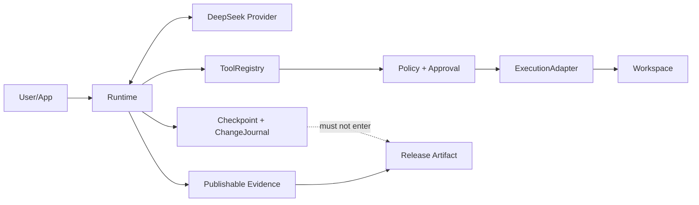

# DeepSeek Runtime Open-source Alpha Threat Model

> 版本：1.4
> 适用代码审查基线：`develop@2fe059d900c4e04fab05ca92f421a41d7ff0aa01`；M2-D closeout PR #21
> 文档修订：以本文件所在 Git commit 为准
> 目标：明确首个 Alpha 保护什么、不保护什么，以及所有安全声明的证据要求。

## 1. 安全结论

DeepSeek Runtime 首个 Alpha 是 **local-first Runtime Kernel**，不是多租户安全执行平台，也不是内核级 sandbox。

首个 Alpha 必须做到：

- Runtime 自身不存在绕过 ToolRegistry、Policy、Approval 和 ExecutionAdapter 的受支持生产工具路径；
- 不可信模型输出和 Provider response 不能直接成为未校验工具执行；
- 声称 bounded subprocess capability 的 Adapter 必须实际执行最小环境、contained cwd、timeout、byte output limit、cancellation handoff 和 process-tree cleanup；
- workspace 工具不能通过 Runtime 自身的路径解析逻辑越出工作区；
- rollback handle 不可由调用方伪造或跨 workspace 使用；
- 不确定外部副作用不会在恢复时自动重试；
- 默认日志、Approval、Evidence 和发布构件不泄露敏感正文和密钥；
- 所有安全承诺有自动化测试和可访问证据。

它不承诺：

- 抵抗同一主机、相同用户权限下的恶意并发进程；
- 阻止已授权子进程访问同一用户本来可访问的工作区外资源；
- 防御恶意 Tool builder 在返回 `SubprocessRequest` 前直接执行副作用；
- 提供容器、虚拟机、Seatbelt、seccomp、Job Object 等内核隔离；
- 对不支持幂等键、receipt 或查询的外部系统提供通用 exactly-once；
- 在宿主机、内核、Python 解释器或依赖被攻破后维持安全边界。

### 1.1 当前实现状态

| 边界 | 当前状态 | 证据/剩余工作 |
| --- | --- | --- |
| ToolRegistry 唯一 Runtime 工具集合 | Verified for M2-A | PR #14，runs 106/56 |
| Policy/Approval 强制链 | Verified for M2-B 内存生产路径 | PR #16，runs 129/77 |
| Approval durable checkpoint/resume | Partial | PR #20 已实现 pending-before-I/O 与全部 resolved outcome 的内存 handoff；durable store、resume、migration 属 M3 |
| ExecutionAdapter 强制链 | Verified for M2-C | PR #18，Minimum CI 165、M1 P0 111、M2 Gate 15 |
| Restricted subprocess controls | Verified for M2-C | 三平台各 36/36；minimal env、cwd、timeout、byte limit、cancel、tree cleanup |
| Full Runtime lifecycle/budget/cancellation | Implemented in PR #20 / pre-merge | state/event/checkpoint handoff、budgets、Provider-before-call 与 tool cancellation 已实现；待 exact-head CI、merge/closeout |
| Workspace containment | Verified for M1 P0 | PR #7/#13；Linux/macOS/Windows |
| Workspace resource budgets | Planned / M2-E | read/search byte/file/time limits 未完整实现 |
| Release artifact safety | Blocked / M5 | tracked allowlist、完整 secret scan、digest/tamper、clean install 未完成 |

因此，M2-D implementation 完成也不构成发布门禁通过；在 merge/closeout 及 M3–M6 完成前结论仍为 **NO RELEASE**。

## 2. 保护资产

| 资产 | 风险 | Alpha 要求 |
| --- | --- | --- |
| DeepSeek API Key | 日志、子进程、异常、构件泄漏 | 默认不存储；不传入 restricted child；所有输出脱敏 |
| Prompt/response/reasoning | Evidence、日志、checkpoint、异常泄漏 | 公开 Evidence 无正文；checkpoint 可选加密 |
| Tool arguments/results | 日志、审批、checkpoint 泄漏 | 默认只输出安全摘要；恢复正文仅进入 checkpoint |
| Workspace 文件 | 越界读写、symlink、冲突覆盖 | canonical containment、链接防护、冲突检测 |
| 外部副作用 | 崩溃后重复执行 | RecoveryPolicy、receipt、uncertain/manual |
| Checkpoint | 明文、篡改、损坏、版本漂移 | 原子写、损坏检测、schema version、可选加密 |
| ChangeJournal | 伪造 rollback、敏感正文、跨 workspace | opaque handle、受保护记录、scope/expiry/schema |
| Release artifact | `.env`、checkpoint、未跟踪文件、篡改 | Git tracked allowlist、secret scan、digest/tamper gate |
| 测试和发布证据 | 虚假通过、rerun 掩盖、文档漂移 | Traceability、失败保留、明确 Release/No Release |

## 3. 不可信输入

以下输入默认不可信：

- 用户 prompt；
- 模型输出、tool name、tool arguments；
- Provider HTTP body、SSE event、usage、request id；
- 工作区路径、文件名、文件内容、symlink/reparse point；
- Tool handler/builder 返回值和异常；
- ApprovalProvider 返回值和异常；
- `SubprocessRequest` command、cwd、env、stdin；
- child stdout/stderr 与 return code；
- checkpoint 文件、schema version、migration input；
- rollback handle；
- 环境变量；
- 构建工作树和未跟踪文件；
- 依赖包和第三方代码来源。

## 4. 信任边界

### 4.1 模型与 Provider 边界

- Provider response 必须先 normalize，再进入 Runtime 和 Evidence；
- 任意 JSON-compatible 根必须返回规范化对象或结构化错误；
- tool name 和 arguments 不因来自模型而获得信任；
- retry 只应用于明确 eligible 的 Provider 请求，不代表 Tool 副作用可重试；
- PR #20 已实现 Provider-before-call cancellation；请求进行中的 transport cancellation 明确移交 M4。

### 4.2 Runtime 与 Registry/Approval 边界

当前保证：

- `DeepSeekRuntime` 只接受 `ToolRegistry | None`，不接受裸 handler mapping；
- Registry 在 Adapter 前完成 tool lookup、JSON Schema validation 和注册合同检查；
- 每个受支持 Runtime 工具调用在 Adapter 前必须有 `PermissionPolicy` decision；
- READ 默认 `ALLOW`，非 READ 默认 `DENY`；
- `ASK` 必须通过 `ApprovalProvider`；
- 缺失 Provider、Provider exception、invalid outcome、deny 或 timeout 均 fail-closed；
- 未获得最终授权时 Adapter/handler 调用次数为 0；
- approve-session 只覆盖同一 `Runtime.run()` 内完全相同的 tool/risk/canonical arguments；
- approval request、authorization evidence 和 policy audit 不保留完整参数值、文件正文、原始路径或命令正文。

当前不保证：

- approval event 已在 handler 前 durable checkpoint；
- 崩溃后 approval session 可恢复；
- approval schema migration 已完成。

这些边界属于 M2-D/M3。

### 4.3 ExecutionAdapter 边界

#### FakeExecutionAdapter

- 只用于确定性测试；
- 不调用真实 handler；
- 不虚标 timeout、output limit、process cleanup、minimal env 或 kernel isolation。

#### NoIsolationLocalAdapter

- 仅适用于可信本地开发和兼容路径；
- 进程内直接调用 handler；
- 不提供 timeout、byte limit、process cleanup、minimal env 或 OS 隔离；
- capability 与 Runtime evidence 必须明确上述限制。

#### RestrictedSubprocessAdapter

已验证保证：

- handler 作为纯 builder 返回 `SubprocessRequest`；
- command 必须为非空参数数组，禁止 shell string；
- cwd 显式且经过 `WorkspaceResolver` containment；
- child environment 只继承 allowlist；
- API key、token、authorization、password、secret 等标记键不传入；
- `PYTHONPATH`、`PYTHONHOME`、`LD_*`、`DYLD_*`、`NODE_OPTIONS` 等 loader/runtime injection key 被拒绝；
- `timeout_seconds` 实际驱动终止；
- cancellation token 驱动终止；
- timeout/cancel 后执行 best-effort process-tree cleanup；
- stdout/stderr 按合计 byte-size limit 保留并标注 truncation；
- blocking stdin 写入不阻塞主 timeout loop；
- handler/builder/Popen/cwd/pipe 错误结构化，不公开异常正文；
- execution evidence 不包含 command、env、stdin、stdout、stderr、arguments、result 或异常正文。

明确限制：

- `kernel_isolation=false`；
- 不阻止已授权 child 读取同用户可访问的外部文件、网络或系统资源；
- process-tree cleanup 是支持平台上的 best-effort，不是抵抗 hostile process 的安全边界；
- 不防御 builder 在返回描述前直接产生副作用；
- private receipt 尚未接入 durable Runtime lifecycle。

### 4.4 Workspace 边界

当前已验证：

- read/search/change/rollback 使用统一 canonical resolver；
- 默认拒绝或跳过 symlink 和 reparse point；
- 每个候选在使用前执行 containment；
- rollback 有 stale-hash 冲突检查；
- `WorkspaceSandbox.run()` 已委托 ExecutionAdapter，不再保留第二套直接 subprocess 生产路径。

首个 Alpha 仍需完成：

- read/search byte、file 和 time budgets；
- UTF-8 byte-safe truncation；
- binary、permission、file-disappeared 等结构化结果。

Runtime 不承诺阻止同一主机恶意进程在检查后、打开前替换路径，也不防御拥有相同用户权限的进程直接绕过 Runtime 访问文件系统。

### 4.5 Checkpoint 与 Evidence 边界

`RecoverableCheckpoint`：

- 包含恢复所需正文；
- 默认仅本地使用；
- 可选加密；
- 不可作为公开诊断报告。

`PublishableEvidence`：

- 只包含结构、长度、安全 identity、usage、cost、状态和脱敏错误；
- 不包含恢复正文；
- 低熵敏感值不得输出可字典猜测的裸 SHA-256。

Authorization 与 execution event 当前是 JSON-compatible、内容最小化的合同记录；这不等于 durable checkpoint timing 或 M3 Evidence totality 已完成。

### 4.6 Rollback 与外部副作用边界

- 调用方只持有 opaque handle；
- handle 不能携带路径、原始正文或可篡改恢复载荷；
- Journal 绑定 workspace、changeset、pre/post hash、expiry、schema；
- rollback 时重新执行 containment、policy 和 stale-hash 检查；
- forged、expired、missing、cross-workspace handle 结构化拒绝；
- PURE/IDEMPOTENT/RETRYABLE_WITH_KEY 按 RecoveryPolicy 处理；
- NON_IDEMPOTENT 或无法确认的 running 状态进入 `TOOL_SIDE_EFFECT_UNCERTAIN`；
- uncertain 不自动重试。

## 5. 主要威胁与控制

| ID | 威胁 | 控制 | 验证/状态 |
| --- | --- | --- | --- |
| TM-001 | Path traversal 越界读 | canonical resolver + containment | TC-WS-001 / Verified M1 P0 |
| TM-002 | symlink/reparse-point 越界搜索 | lstat/skip/resolve/containment | TC-WS-002/003 / Verified M1 P0 |
| TM-003 | Forged rollback 写删外部文件 | opaque handle + ChangeJournal + policy | TC-CHG-001/002 / Verified M1 P0 |
| TM-004 | stale rollback 覆盖后续修改 | post-change hash conflict | TC-CHG-005 |
| TM-005 | rollback handle 重启/跨 workspace 混淆 | scope/expiry/schema/journal lookup | TC-CHG-011 |
| TM-006 | Runtime Tool 绕过 Registry/Policy/Approval/Adapter | mandatory ordered production path | TC-RUN-004、TC-SEC-004 / Verified M2 |
| TM-007 | 子进程继承 API Key/loader injection | minimal allowlist + secret/unsafe key filter | TC-SEC-005 / Verified M2-C |
| TM-008 | timeout/cancel 后子进程残留 | process-tree cleanup | TC-SEC-006 / Verified M2-C |
| TM-009 | 命令 Gate/Restricted 被误认为隔离 | capability、命名、负向 wrapped-command tests | TC-SEC-007/009 / Verified M2-C |
| TM-010 | Builder 在 Adapter 前产生副作用 | builder contract、受信任 Tool 边界、文档非保证 | Known limitation / M3 recovery |
| TM-011 | 崩溃后重复副作用 | uncertain/manual、receipt、idempotency | TC-SES-006/007/009 |
| TM-012 | malformed Provider 绕过结构化错误 | normalization-before-evidence | TC-PROV-002–004、TC-RUN-010 |
| TM-013 | Evidence/Approval/Execution 泄漏正文或 Key | content-free evidence + minimized audit | TC-SEC-008、TC-EVD-001/005/007 |
| TM-014 | 低熵 hash 可猜 | HMAC 或不输出 identity | TC-EVD-004 |
| TM-015 | Checkpoint 明文或损坏 | optional encryption + atomic/corrupt checks | TC-SES-003/004/011 |
| TM-016 | 构件包含未跟踪 secret | Git tracked allowlist + secret scan | TC-OSS-003/005 |
| TM-017 | 篡改构件仍通过 | digest recomputation + tamper test | TC-OSS-004 |
| TM-018 | 文档/测试优先级漂移 | PRD source of truth + traceability gate | TC-OSS-007/008 |
| TM-019 | flaky/rerun 掩盖安全失败 | retained failures + no-rerun release rule | Release Gate |

## 6. 安全测试要求

- P0 测试不得 quarantine；
- P0 测试在适用平台连续运行 20 次无失败；
- P0 manifest 中目标分支 coverage = 100%；
- M2 ExecutionAdapter Gate 在 Linux/macOS/Windows 运行并上传明确分母 artifact；
- Policy/Approval denial、timeout、unavailable 和 malformed 输入必须证明 Adapter/handler 调用次数为 0；
- timeout/cancel 必须验证 descendant cleanup；
- child environment 必须验证 API key、secret marker 与 loader key 不存在；
- Release Gate 必须 100% 通过；
- 不允许用 rerun 后成功作为 Release 证据。

## 7. 漏洞响应与 No-Go

公开 Alpha 前必须在 `SECURITY.md` 明确私密报告渠道、支持版本、响应目标、严重度分类和修复流程。

发现以下任一问题立即 No-Go：

- 越界写删；
- API Key 或默认正文泄漏；
- Runtime Registry/Policy/Approval/Adapter 绕过；
- timeout/cancel 后可复现的普通 descendant 残留；
- 重复高价值副作用；
- 发布构件包含 secret；
- rollback handle 可伪造或跨 workspace；
- CI 只能通过 rerun。

## 8. 审查与变更规则

以下变化必须更新本 Threat Model 和相关 ADR/合同：

- 新 Tool 类型或 RecoveryPolicy；
- 新 Policy/Approval outcome 或持久化语义；
- 新 ExecutionAdapter 或 capability；
- checkpoint、evidence 或 ChangeJournal schema；
- workspace/path 处理；
- Provider streaming/retry/cancellation；
- release artifact pipeline；
- 从 local-first 向 hosted/multi-tenant 扩展。

Threat Model 未同步更新的安全边界变化不得合入 `develop`。

当前发布结论：**NO RELEASE**。
