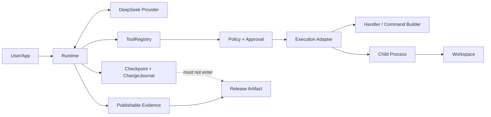

# DeepSeek Runtime Open-source Alpha Threat Model

> 版本：1.2
> 适用代码审查基线：`develop@a8a0f3c8d0e417fa8ffe465cec1763063ca9eead`；M2-C implementation PR #18
> 文档修订：以本文件所在 Git commit 为准
> 目标：明确首个 Alpha 保护什么、不保护什么，以及所有安全声明的证据要求。

## 1. 安全结论

DeepSeek Runtime 首个 Alpha 是 **local-first Runtime Kernel**，不是多租户安全执行平台，也不是内核级 sandbox。

首个 Alpha 必须做到：

- Runtime 自身不存在绕过 ToolRegistry、Policy、Approval 和 ExecutionAdapter 的受支持生产工具路径；
- 不可信模型输出和 Provider response 不能直接成为未校验工具执行；
- 声称 bounded subprocess capability 的 Adapter 必须实际执行最小环境、contained cwd、timeout、byte output limit、cancellation handoff 和 process-tree cleanup；
- workspace 工具不能通过 Runtime 自身的路径解析逻辑越出工作区；
- rollback handle 不可由调用方伪造或跨 workspace 使用；
- 不确定外部副作用不会在恢复时自动重试；
- 默认日志、Approval、Evidence 和发布构件不泄露敏感正文和密钥；
- 所有安全承诺有自动化测试和发布证据。

它不承诺：

- 抵抗同一主机、相同用户权限下的恶意并发进程；
- 提供容器、虚拟机、Seatbelt、seccomp、Job Object、namespace 等内核隔离；
- 阻止 Restricted 子进程访问同一宿主用户可访问的其他资源；
- 阻止恶意 Python handler/command builder 在返回 Adapter request 前自行产生副作用；
- 对 hostile process 提供绝对 process-tree cleanup；
- 对不支持幂等键、receipt 或查询的外部系统提供通用 exactly-once；
- 在宿主机、内核、Python 解释器或依赖被攻破后维持安全边界。

### 1.1 当前实现状态

| 边界 | 当前状态 | 证据/剩余工作 |
| --- | --- | --- |
| ToolRegistry 唯一 Runtime 工具集合 | Verified for M2-A | PR #14，runs 106/56 |
| Policy/Approval 强制链 | Verified for M2-B 内存生产路径 | PR #16，runs 129/77 |
| Approval durable checkpoint/resume | Partial | event contract 可 round-trip；持久化时机、resume、migration 属 M2-D/M3 |
| ExecutionAdapter | Implemented on PR #18 | code-complete runs 159/105；M2 Gate run 9 三平台各 36/36；等待 final docs Gate/merge |
| Provider cancellation / complete lifecycle | Partial / M2-D | Tool execution cancellation handoff 已实现；Provider 前/请求中 cancellation 未完成 |
| Workspace containment | Verified for M1 P0 | PR #7/#13，Linux/macOS/Windows 20/20 |
| Workspace resource budgets | Planned / M2-E | read/search byte/file/time limits 尚未完整实现 |
| Release artifact safety | Blocked / M5 | tracked allowlist、完整 secret scan、digest/tamper、clean install 未完成 |

因此，PR #18 的实现证据不改变当前结论：**NO RELEASE**。

## 2. 保护资产

| 资产 | 风险 | Alpha 要求 |
| --- | --- | --- |
| DeepSeek API Key | 日志、子进程、异常、构件泄漏 | 默认不存储；Restricted child 不继承；所有公开输出脱敏 |
| Prompt/response/reasoning | Evidence、日志、checkpoint、异常泄漏 | 公开 Evidence 无正文；checkpoint 可选加密 |
| Tool arguments/results | 日志、审批、Adapter evidence、checkpoint 泄漏 | 公开面只输出安全摘要；恢复正文仅进入私有 checkpoint |
| SubprocessRequest | command、cwd、env、stdin 泄漏或注入 | 仅执行期内存；不进入公开 Evidence/error；env key 限制 |
| Workspace 文件 | 越界读写、symlink、冲突覆盖 | canonical containment、链接防护、冲突检测 |
| 外部副作用 | 崩溃后重复执行 | RecoveryPolicy、receipt、uncertain/manual |
| Checkpoint | 明文、篡改、损坏、版本漂移 | 原子写、损坏检测、schema version、可选加密 |
| ChangeJournal | 伪造 rollback、敏感正文、跨 workspace | opaque handle、受保护记录、scope/expiry/schema |
| Release artifact | `.env`、checkpoint、未跟踪文件、篡改 | Git tracked allowlist、secret scan、digest/tamper gate |
| 测试和发布证据 | 虚假通过、rerun 掩盖、文档漂移 | Traceability、明确分母、无 rerun 掩盖、明确 No Release |

## 3. 不可信输入

以下输入默认不可信或半可信：

- 用户 prompt；
- 模型输出、tool name、tool arguments；
- Provider HTTP body、SSE event、usage、request id；
- 工作区路径、文件名、文件内容、symlink/reparse point；
- Tool handler / command builder 返回值、异常和潜在副作用；
- ApprovalProvider 返回值和异常；
- ExecutionAdapter 实现、capability 声明和异常；
- command、cwd、environment、stdin、stdout、stderr；
- checkpoint 文件、schema version、migration input；
- rollback handle；
- 宿主环境变量；
- 构建工作树和未跟踪文件；
- 依赖包和第三方代码来源。

## 4. 信任边界



PR #18 建立 `Policy/Approval → ExecutionAdapter` 强制边界；完整 lifecycle 与 durable checkpoint 仍由 M2-D/M3 建立。

### 4.1 模型与 Provider 边界

- Provider response 必须先 normalize，再进入 Runtime 和 Evidence；
- 任意 JSON-compatible 根必须返回规范化对象或结构化错误；
- tool name 和 arguments 不因来自模型而获得信任；
- Provider retry 不代表 Tool 副作用可重试；
- Provider 请求前/请求中 cancellation 仍未完成。

### 4.2 Runtime、Registry、Policy 与 Approval 边界

已合入保证：

- `DeepSeekRuntime` 只接受 `ToolRegistry | None`，不接受裸 handler mapping；
- Registry 在执行前完成 tool lookup、JSON Schema validation 和注册合同检查；
- 每个受支持 Runtime 工具调用必须有 `PermissionPolicy` decision；
- READ 默认 `ALLOW`，非 READ 默认 `DENY`；
- `ASK` 必须通过 `ApprovalProvider`；
- unavailable、exception、invalid outcome、deny、timeout 均 fail-closed；
- 未获得最终授权时 handler 和 Adapter 调用次数均为 0；
- approve-session 只覆盖同一 `Runtime.run()` 内完全相同的 tool/risk/canonical arguments；
- Approval/evidence/audit 不保留完整参数值、文件正文、原始路径或命令正文。

仍不保证：

- approval event 已在 handler 前 durable checkpoint；
- 崩溃后 approval session 可恢复；
- approval schema migration 已完成。

### 4.3 ExecutionAdapter 边界

PR #18 定义统一 Adapter Protocol 和机器可读 capability。所有当前 Adapter 的 `kernel_isolation=false`。

#### FakeExecutionAdapter

- 不调用 handler；
- 返回 scripted outcome；
- 用于 ordering、fault、privacy 和 cancellation 测试；
- 不虚标 timeout、output、environment 或 process cleanup capability。

#### NoIsolationLocalAdapter

- 当前 Python 进程内调用可信 handler；
- handler exception 结构化为 `TOOL_EXECUTION_FAILED`，不公开异常正文；
- 仅能在 handler 开始前拒绝已取消 token；
- 不提供运行中 cancellation、timeout、output limit、minimal env、process cleanup 或 OS 隔离。

#### RestrictedSubprocessAdapter

已实现并由三平台专项 Gate 验证：

- handler 仅作为纯 command builder，必须返回 `SubprocessRequest`；
- command 必须是参数 tuple，`shell=False`；
- cwd 显式且经过 `WorkspaceResolver`；
- 子进程环境从小型 allowlist 构建；
- API key、token、authorization、password、credential、secret 等 key 被移除；
- `PYTHONPATH`、`PYTHONHOME`、`LD_*`、`DYLD_*`、`NODE_OPTIONS` 等 loader/runtime injection key 被移除；
- ToolSpec timeout 实际 enforcement；
- stdout/stderr 合并按 byte 限制；
- stdin 独立线程写入，不阻塞 timeout/cancellation loop；
- timeout、cancel、output overflow 触发 process-tree cleanup；
- Unix 使用独立 process group TERM/KILL；Windows 使用 `taskkill /T /F`，辅助进程也使用最小环境；
- builder、handler、spawn 和 Adapter exception 不公开异常正文；
- execution evidence 不含 arguments、command、cwd、env、stdin、stdout、stderr、result 或 private receipt。

非保证：

- 不是 kernel sandbox；
- 子进程仍可能访问同一用户有权访问的文件、网络和系统调用；
- 对 hostile process 的 cleanup 仅为 best-effort；
- builder 是 Python 代码，M2-C 不能阻止恶意 builder 在返回 request 前执行副作用；
- private receipt 尚未 durable checkpoint。

### 4.4 WorkspaceSandbox 兼容边界

`WorkspaceSandbox.run()` 不再直接调用 `subprocess.run`。当前路径：

```text
command array validation
→ risk classification
→ cwd containment
→ PermissionPolicy
→ temporary ToolSpec/SubprocessRequest
→ configured ExecutionAdapter
→ validated CommandResult
```

默认 command Adapter 是 `RestrictedSubprocessAdapter`。`WorkspaceSandbox` 名称是兼容名称，不构成 isolation 保证。

命令分类器不是 sandbox。`bash -c curl`、`python -c import socket`、`env curl` 等包装命令可被分类为 `SHELL_SAFE`；该负向行为由 `TC-SEC-007` 固定，防止文档把 Gate 误称为隔离。

### 4.5 Workspace 边界

已验证：

- read/search/change/rollback 使用统一 canonical resolver；
- 默认拒绝或跳过 symlink 和 reparse point；
- 每个候选在使用前执行 containment；
- rollback 有 stale-hash 冲突检查；
- Restricted subprocess cwd 经过同一 resolver。

仍需完成：

- read/search byte、file 和 time budgets；
- UTF-8 byte-safe truncation；
- binary、permission、file-disappeared 等结构化结果。

不承诺：

- 阻止同一主机恶意进程在检查后、打开前替换路径；
- 防御同一用户进程直接绕过 Runtime 访问文件系统。

### 4.6 Checkpoint 与 Evidence 边界

`RecoverableCheckpoint`：包含恢复正文，默认仅本地使用，可选加密，不可作为公开诊断报告。

`PublishableEvidence`：只包含结构、长度、安全 identity、usage、cost、状态和脱敏错误，不包含恢复正文。

M2-B authorization event 和 M2-C execution event 都是内容最小化合同记录。M2-C `ExecutionOutcome.private_receipt` 尚未接入 durable checkpoint；这不等于 recovery 闭环完成。

### 4.7 Rollback 与 ChangeJournal 边界

- 调用方只持有 opaque handle；
- handle 不携带路径、原始正文或可篡改恢复载荷；
- Journal 绑定 workspace、changeset、pre/post hash、expiry、schema；
- rollback 重新执行 containment、policy 和 stale-hash 检查；
- forged、expired、missing、cross-workspace handle 结构化拒绝；
- Journal 可选加密，默认不进入发布构件。

### 4.8 外部副作用边界

崩溃窗口：effect 前；effect 成功后、succeeded checkpoint 前；succeeded checkpoint 后。

- PURE/IDEMPOTENT/RETRYABLE_WITH_KEY 按 RecoveryPolicy 处理；
- NON_IDEMPOTENT 或无法确认的 running 状态进入 `TOOL_SIDE_EFFECT_UNCERTAIN`；
- uncertain 不自动重试；
- 人工 reconcile/mark/abandon/retry 决策必须进入 checkpoint 和 evidence；
- M2-C Adapter control 不替代 durable TOOL_RUNNING checkpoint。

## 5. 主要威胁与控制

| ID | 威胁 | 控制 | 验证/状态 |
| --- | --- | --- | --- |
| TM-001 | Path traversal 越界读 | canonical resolver + containment | TC-WS-001 / Verified M1 P0 |
| TM-002 | symlink/reparse-point 越界 | no-follow/resolve/containment | TC-WS-002/003 / Verified M1 P0 |
| TM-003 | forged rollback 写删外部文件 | opaque handle + Journal + policy | TC-CHG-001/002 / Verified M1 P0 |
| TM-004 | stale rollback 覆盖后续修改 | post-change hash conflict | TC-CHG-005 |
| TM-005 | rollback 重启/跨 workspace 混淆 | scope/expiry/schema/journal lookup | TC-CHG-011 |
| TM-006 | Runtime Tool 绕过 Registry/Policy/Approval/Adapter | ordered mandatory production path | TC-RUN-004、TC-SEC-004、M2 Gate run 9 |
| TM-007 | 子进程继承 API Key/secret | minimal env + secret/loader key stripping | TC-SEC-005、M2 Gate run 9 × 3 OS |
| TM-008 | timeout/cancel 后进程残留 | process-group/tree cleanup | TC-SEC-006、M2 Gate run 9 × 3 OS |
| TM-009 | 命令 Gate/Restricted process 被误认为隔离 | capability map + wrapped-command negative + docs | TC-SEC-007/009 |
| TM-010 | 无限 stdout/stderr/阻塞 stdin | combined byte limit + async stdin + timeout | TC-TOOL-005/006、run 9 |
| TM-011 | loader/runtime env 注入 | deny known injection keys | Adapter limit tests × 3 OS |
| TM-012 | handler/builder/Adapter exception 泄漏 | structured error without message | TC-SEC-008、run 9 |
| TM-013 | 崩溃后重复副作用 | uncertain/manual、receipt、idempotency | TC-SES-006/007/009 |
| TM-014 | malformed Provider 绕过结构化错误 | normalization-before-evidence | TC-PROV-002–004、TC-RUN-010 |
| TM-015 | Evidence/Approval 泄漏正文或 Key | content-minimized events + redaction | TC-SEC-008、TC-EVD-001/005/007 |
| TM-016 | 低熵 hash 可猜 | HMAC 或不输出 identity | TC-EVD-004 |
| TM-017 | Checkpoint 明文或损坏 | optional encryption + atomic/corrupt checks | TC-SES-003/004/011 |
| TM-018 | 构件包含 secret / 被篡改 | tracked allowlist + scan + digest/tamper | M5 Gate |
| TM-019 | 文档/测试优先级漂移 | PRD source of truth + Traceability gate | TC-OSS-007/008 |
| TM-020 | flaky/rerun 掩盖失败 | retained runs + explicit denominators | Release Gate |

## 6. 安全测试要求

- P0 测试不得 quarantine；
- P0 测试在适用平台连续运行 20 次无失败；
- Policy/Approval rejection 必须证明 handler 和 Adapter 调用次数为 0；
- Restricted Adapter capability 必须在 Linux、macOS、Windows 直接验证；
- focused Gate 必须记录明确 denominator、failures、errors 和 skipped；
- capability 不得仅靠文档声明；
- process cleanup fixture 必须启动 descendant 并验证其后续副作用未发生；
- 环境测试必须覆盖 host secret、explicit secret 和 loader injection key；
- Release Gate 必须 100% 通过；
- 不允许用 rerun 后成功替代失败证据。

## 7. 漏洞响应

公开 Alpha 前必须在 `SECURITY.md` 明确私密报告渠道、支持版本、响应目标、严重度、修复/公告流程，并禁止公开提交真实 Key、prompt、response、checkpoint 或 exploit data。

发现以下任一问题立即 No-Go：

- 越界写删；
- API Key 或默认正文泄漏；
- Runtime Registry/Policy/Approval/Adapter 绕过；
- 声称 Restricted capability 但 timeout/output/environment/cleanup 未实际执行；
- 重复高价值副作用；
- 发布构件包含 secret；
- rollback handle 可伪造或跨 workspace；
- CI 只能通过 rerun。

## 8. 审查与变更规则

以下变化必须更新本 Threat Model 和相关合同/ADR：

- 新 Tool 类型或 RecoveryPolicy；
- 新 Policy/Approval outcome 或持久化语义；
- 新 ExecutionAdapter 或 capability；
- command/env/cwd/stdin/output/process cleanup 处理；
- checkpoint、evidence 或 ChangeJournal schema；
- workspace/path 处理；
- Provider streaming/retry/cancellation；
- release artifact pipeline；
- 从 local-first 向 hosted/multi-tenant 扩展。

Threat Model 未同步更新的安全边界变化不得合入 `develop`。
